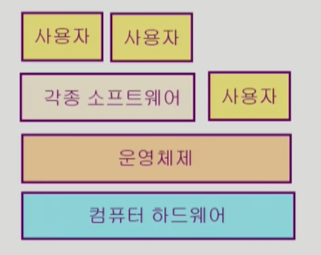
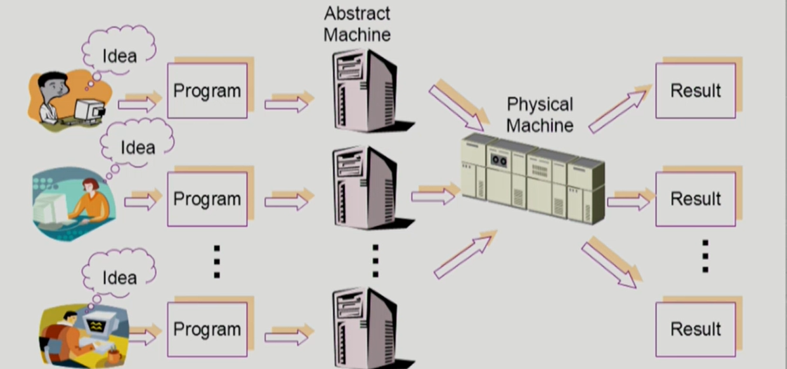
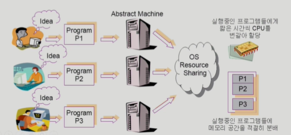

# 강의소개

- 운영체제(Operating Systems, OS)
    - 담당교수 : 반효경

- 운영체제는 컴퓨터 하드웨어 바로 위에 설치되는 소프트웨어 계층으로서 모든 컴퓨터 시스템의 필수적인 부분이다. 본 강좌에서는 이와 같은 운영체제의 개념과 역할, 운영체제를 구성하는 각 요소 및 그 알고리즘의 핵심적인 부분에 대해 기초부터 학습한다.

## 강의 내용
- 운영체제 개요
- 컴퓨터시스템의 구조
- 프로세스 관리
- CPU 스케줄링
- 병행 제어
- 데드락
- 메모리 관리
- 가상 메모리
- 파일 시스템
- 입출력 시스템
- 디스크 관리

## 운영체제란 무엇인가?
- 컴퓨터 하드웨어 바로 위에 설치되어 사용자 및 다른 모든 소프트웨어와 하드웨어를 연결하는 소프트웨어 계층.

- 하드웨어랑 어떻게 인터페이스를 하는가? 사용자, 소프트웨어와 어떻게 상호작용하는가가 하드웨어의 큰 두가지 목표.

## 운영체제의 목표
- 컴퓨터 시스템을 편리하게 사용할 수 있는 환경 제공
    - 운영체제는 동시 사용자/프로그램들이 각각 독자적 컴퓨터에서 수행되는 것 같은 환상 제공.
    - 하드웨어를 직접 다루는 복잡한 부분을 운영체제가 대행.

- 컴퓨터 시스템의 <u>자원을 효율적으로 관리</u>(전공자 입장에서는 중요)
    - 줄여서 자원관리자.
    - 자원은 컴퓨터 시스템의 CPU, 메모리, 입출력장치 등.
    - 프로세서, 기억장치, 입출력 장치 등의 효율적 관리.
- CPU룰 실행중인 프로그램들에게 짧은 시간씩 번갈아 할당하거나 메모리 공간을 실행중인 프로그램에 따라 어느 정도 분배할지 결정하는 등의 역할을 해서 프로그램이 효율적으로 돌아가도록 만들어준다.
- 그렇다고 특정 프로그램이 너무 안돌아가고 하는것도 방지.
