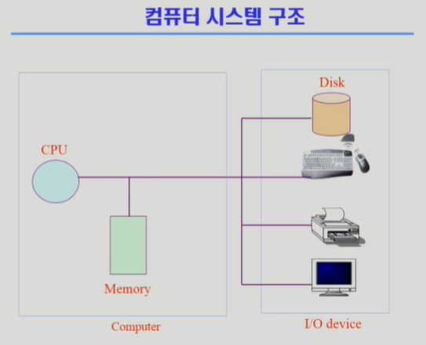
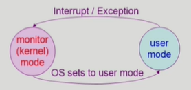

# System Structure & Program Execution
- 운영체제 설명하기에 앞서서 컴퓨터 시스템에서 하드웨어의 동작과 프로그램이 어떻게 돌아가는지 알아보자.

## 컴퓨터 시스템 구조

- CPU, Memory로 구성된게 컴퓨터
- 나머지가 Input/Output Device, 데이터가 컴퓨터로 들어가는게 Input, 나가는게 Output.

- 메모리는 CPU의 작업공간. CPU는 매 클럭 사이클마다 메모리로부터 Instruction을 읽어 실행.
- I/O Device는 별개의 디바이스.
- 키보드, 마우스는 Input Device, 모니터, 프린터는 Output Device. 하드디스크는 보조메모리이지만 I/O Device(둘 다 역할함.)
- 이런 각각의 I/O Device는 이들을 전담하는 작은 CPU인 device controller가 달려 있다. 
    - 예를 들어, Disk의 헤드를 어디로 움직일지 같은 작업은 CPU가 아닌 Disk에 달린 disk controller가 수행한다.
- 메인 CPU에 작업공간인 메인 메모리가 있듯, device controller에도 local buffer라는 작업공간이 있다.
- CPU와 I/O device의 처리 시간에는 차이가 크게 존재하므로 이들을 관리하는 device controller가 따로 있다. 
- CPU의 역할은 오로지 메모리로부터 Instruction을 읽어 실행하는 역할이다.
    - CPU 안에는 메모리보다 빠르면서 정보 저장이 가능한 register가 있다.
    - CPU 안에는 mode bit이라는 것이 있는데, 지금 CPU가 실행하는 명령어가 운영체제인지, 사용자 프로그램인지 구분하는 역할을 한다.
    - CPU 안에는 Interrupt line이라는 것이 있는데, CPU는 항상 메모리의 Instruction만 읽어오는데, 만약 키보드나 디스크 같은 I/O Device로부터 오는 입력이나 출력을 감지하기 위해 이 line이 존재한다.
        - 예를 들어, 프로그램 A를 실행하다가 키보드 입력을 받아야 하거나, 디스크에 접근해야 하는 경우, 화면에 뭘 출력해야 하는 등의 작업을 해야 한다면 CPU가 I/O Device에 직접 접근 못하고 메모리만 접근할 수 있으니, device controller로 시킬 일을 보내고, 그 결과는 local buffer에 저장된다. 그리고 CPU는 일 시켜놓고 본인이 할 일을 한다. 하나의 instruction이 끝날 때마다 CPU는 interrupt line을 체크하는데, interrupt 받으면 이제 해당 작업 수행한다.
        - `timer` : 만약 어떤 프로그램이 무한루프를 돈다면? 계속 CPU가 그 작업에 매달려 다른 프로그램으로 넘어가는 time sharing이 불가능해진다. 또, 어느 프로그램은 너무 많은 시간을 사용해야 하므로 time sharing이 어려울 수 있다. 이를 방지하기 위해 timer가 존재한다. timer는 특정 프로그램이 CPU 독점하는 것을 막기 위해 존재한다. 사용자 프로그램은 실행될 때, timer에 값을 넘기고 CPU에서 실행된다. 그래서 timer에 설정된 시간만큼 지나면 timer는 CPU에 interrupt를 보낸다. 그러면 CPU는 하던 일을 멈추고 CPU의 제어권이 사용자 프로그램에서 OS로 넘어간다(운영체제가 CPU에 프로그램 주는건 자유지만 이미 준걸 뺐을 수는 없다. OS가 뭘 보낼 수 있어야 명령어를 실행하는데 이미 프로그램이 점령했으니.). 그러면 운영체제는 다음 프로그램을 CPU에 넘겨준다(물론 timer 세팅하고).
        - 그 외에도 만약 사용자 프로그램이 I/O가 필요하게 되면 자동으로 OS에 CPU 권한을 넘길 수도 있다. 사용자 프로그램은 직접 I/O에 접근할 수 없고, 오로지 OS만 접근 가능하니 OS가 작업을 해당 디바이스에 요청한다. I/O를 요청한 프로그램은 I/O device가 작업을 끝내고 interrupt를 CPU에 걸었을 때, CPU의 제어권이 OS에 넘어가고, OS에서 이를 판단하고 난 뒤에야 그 결과가 반영된다. 그리고 기존 작업 순서대로 다시 프로그램이 실행되고, 나중에 그 프로그램의 차례가 되돌아 오면 실행된다.

## Mode bit
- CPU에 설정됨.
- 사용자 프로그램의 잘못된 수행으로 다른 프로그램 및 운영체제에 피해 가지 않도록 하기 위한 보호 장치 필요
- Mode bit을 통해 하드웨어적 두 가지 모드의 operation 지원
    - 1 : 사용자 모드, 사용자 프로그램 수행.
    - 0 : 모니터 모드(= 커널 모드, 시스템 모드), OS 코드 수행
    - 보안을 해칠 수 있는 중요한 명령어는 모니터 모드에서만 수행 가능한 `특권명령`으로 규정
    - 사용자 모드에서도 사용 가능한 명령어는 `일반명령`.
    - Interrupt나 Exception 발생시 하드웨어가 mode bit을 0으로 바꿈
    - 사용자 프로그램에게 CPU 넘기기 전에 mode bit을 1로 세팅
    

## Timer
- 타이머
    - 정해진 시간이 흐른 뒤 운영체제에게 제어권이 넘어가도록 인터럽트 발생시킴
    - 타이머는 매 클럭 틱 때마다 1씩 감소
    - 타이머 값이 0이 되면 타이머 인터럽트 발생
    - CPU를 특정 프로그램이 독점하는 것으로부터 보호
- 타이머는 time sharing을 구현하기 위해 널리 이용됨
- 타이머는 현재 시간 계산 위해서도 사용

## Device Controller
- I/O device controller
    - 해당 I/O 장치유형 관리하는 일종의 작은 CPU
    - 제어 정보를 위해 control register, status register 가짐
        - CPU가 무슨 일을 시킬 때, 해당 register를 통해 일을 시킨다는 의미.
    - local buffer 가짐(일종의 data register)
        - 담은 data를 메모리로 보내주거나, 메모리에서 보낸 data를 화면 출력 등을 하기 위해 저장하는 용도. data는 보내고, controller에게 출력 하도록 시킨다.
- I/O는 실제 device와 local buffer 사이에서 일어남
- Device controller는 I/O가 끝났을 경우 interrupt로 CPU에 그 사실 알림.

- device driver(장치구동기) : OS 코드 중 각 장치별 처리루틴 -> software
    - 디바이스 설치하면, 이걸 OS에 설치해 주어야겠죠?
    - 디스크 헤드를 어떻게 움직여라 같은 명령어가 아니라 CPU가 뭔가를 시킬 때 쓰려는 용도.
    - 참고로, 디스크 헤드를 움직이는 건 device controller의 firmware의 역할.
- device controller(장치제어기) : 각 장치를 통제하는 일종의 작은 CPU -> hardware

- 참고로 메인 메모리를 전담하는 memory controller도 존재한다.

- local buffer에 뭔가 쌓이면 CPU에서도 이걸 처리해준다. 즉, CPU는 메인 메모리 뿐만 아니라 사실은 local buffer도 접근 가능하다. 근데, interrupt가 너무 많다. 그럼 CPU가 비효율적이겠죠? 이를 위해 DMA(Direct Memory Access) controller가 존재한다.
    - DMA controller는 직접 메모리에 접근 가능한 컨트롤러다. 원래는 메모리는 CPU만 접근할 수 있지만 이 장치를 두게 되면 이 장치로도 접근이 가능해진다. 물론, 둘이 동시에 접근하면 문제 생기니 memory controller는 이를 중재하는 역할도 한다.
    - 이 장치가 있는 이유는 I/O device가 CPU에 interrupt를 너무 많이 거는 것을 방지하기 위해, local buffer에 뭔가 쌓이면 그걸 메모리에 반영해주고, 나중에 다 끝난 뒤에야 한번 CPU에 interrupt 걸어 "해당 일 다 끝났어요."하고 보고해 주는 방식을 통해 CPU에 걸리는 interrupt를 줄여 효율적 사용을 가능하게 해준다.

## 입출력(I/O)의 수행
- 모든 입출력 명령은 특권 명령
- 사용자 프로그램은 어떻게 I/O를 하는가?
    - 시스템콜(system call)
        - 사용자 프로그램은 운영체제에게 I/O 요청
        - 사용자 프로그램이 운영체제 커널에 function 요청하는게 바로 시스템콜.
        - 사용자 프로그램의 함수 호출과는 다른게, 사용자 프로그램은 메모리 상에서 사용자 프로그램이 저장된 위치 내에서 다음 명령어 수행 위치를 바꾸는 정도지만, 시스템콜은 직접 OS의 위치로 점프를 할 수 없으므로, 프로그램이 직접 interrupt line 설정하는 instruction을 실행한다(SW interrupt, trap). 그렇게 interrrupt를 걸어서 운영체제로 CPU 권한을 넘기고, 운영체제로 전환된 후 이 interrupt를 이용해 I/O로 접근할 수 있게 한다.
    - trap을 사용하여 인터럽트 벡터의 특정 위치로 이동
    - 제어권이 인터럽트 벡터가 가리키는 인터럽트 서비스 루틴으로 이동
    - `올바른 I/O 요청인지 확인 후` I/O 수행
    - I/O 완료 시 제어권을 시스템콜 다음 명령으로 옮김.

## 인터럽트(Interrupt)
- 인터럽트
    - 인터럽트 당한 시점의 레지스터와 program counter를 save한 후, CPU의 제어를 인터럽트 처리 루틴에 넘긴다.
- Interrupt(넓은 의미)
    - Interrupt(하드웨어 인터럽트) : 하드웨어가 발생시킨 인터럽트, 일반적인 의미의 인터럽트.
    - Trap(소프트웨어 인터럽트)
        - Exception : 프로그램이 오류를 범한 경우
        - System call : 프로그램이 커널 함수를 호출하는 경우

- 인터럽트 관련 용어
    - 인터럽트 벡터
        - 해당 인터럽트의 처리 루틴 주소를 가지고 있음
        - 인터럽트 라인 별로 주소가 지정되어 있다고 생각하면 된다.
    - 인터럽트 처리 루틴(=Interrupt Service Routine, 인터럽트 핸들러)
        - 해당 인터럽트를 처리하는 커널 함수
        - 인터럽트 종류마다 해야 할 일이 다르겠죠?
        - 어떤 인터럽트 들어오면 뭐 해라는 것은 OS에 정의되어 있고, 그게 인터럽트 처리 루틴.

- `현대의 운영체제는 인터럽트에 의해 구동됨.`
    - 현대의 운영체제는 인터럽트가 들어올 때만 실행되고, 그 외에는 사용자 프로그램이 사용.
- I/O요청은 SW interrupt로, I/O 완료 후에는 HW interrupt로(I/O controller가 걸어줌).

## 시스템콜(System Call)
- 시스템콜
- 사용자 프로그램이 운영체제의 서비스를 받기 위해 커널 함수를 호출하는 것.
- I/O 요청 뿐만이 아니라 커널 함수 호출이 필요하면 한다.