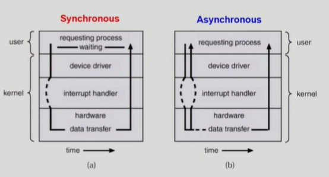
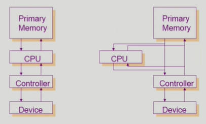
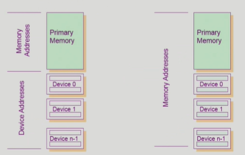
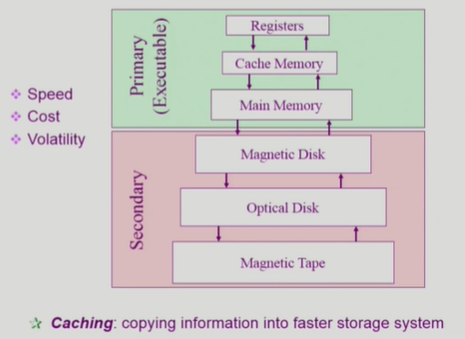
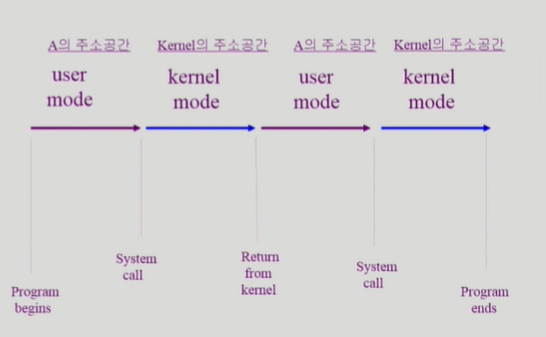

# System Structure & Program Execution 2

- 컴퓨터는 다른 말로 '호스트'라고도 부른다.
- CPU에서 instruction을 읽어오는 주소는 Program Counter라는 register에 저장되어 있고, instruction 하나를 읽어올 때마다 PC(Program Counter)는 다음 instruction으로 주소값을 갱신한다. 특별한 일이 없으면 순차적으로 값이 예를들면 +4씩 되며 갱신하고(4byte씩 읽을 경우), jump instruction 만나면 좀 멀리 갈 수도 있다.

## 동기식 입출력과 비동기식 입출력

- 동기식 입출력(synchronous I/O)
    - I/O 요청 후 입출력 `작업이 완료된 후에야` 제어가 해당 사용자 프로그램에 넘어감
    - 구현 방법 1
        - I/O가 끝날 때까지 CPU를 낭비 시킴
        - 매시점 하나의 I/O만 일어날 수 있음
        - CPU, I/O 둘 다 낭비.
    - 구현 방법 2
        - I/O가 완료될 때까지 해당 프로그램에게서 CPU를 빼앗음
        - I/O 처리를 기다리는 줄에 그 프로그램을 줄 세움
        - 다른 프로그램에게 CPU를 줌
        - I/O 장치도 여럿이 동시에 실행 가능하다.

- 비동기식 입출력(asynchronous I/O)
    - I/O가 시작된 후 입출력 작업이 끝나기를 `기다리지 않고` 제어가 해당 사용자 프로그램에 즉시 넘어감

- <u>두 경우 모두 I/O의 완료는 `인터럽트`로 알려줌</u>
- 두 I/O의 차이는? 만약 내가 프로그램을 짰는데, I/O로 요청한 data가 필요한 경우는 다음 작업을 위해 해당 data가 필요하니 synchronous만 가능. 하지만, 해당 data와 관계 없는 작업들을 실행할 수 있다면 asynchronous하게 할 수도 있다.
    - writing의 경우 예를 들어, 모니터에 뭐 띄우라고 요청 보냈거나 파일에 뭐 쓰라고 요청 보낸 후, 그걸 꼭 확인해야 할 필요는 없으니 일반적으로 `asynchronous`하다. 하지만, 어떤 때는 꼭 확인하고 싶을 것이다. 그 때는 synchronous를 쓴다.
- 결론적으로 구현하기 나름이다. 하지만 I/O는 오래 걸리는 작업이니, synchronous I/O를 걸면 해당 프로그램 말고 다른 프로그램으로 CPU가 넘어간다(위의 구현 방법 2).

## DMA(Direct Memory Access)

- 오른쪽 그림의 Controller가 DMA controller에 해당한다.

- DMA(Direct Memory Access)
    - 빠른 입출력 장치를 메모리에 가까운 속도로 처리하기 위해 사용
    - CPU의 중재 없이 device controller가 device의 buffer storage의 내용을 메모리에 block 단위로 직접 전송
    - 바이트 단위가 아니라 block 단위로 인터럽트 발생시킴.

- 원래 메모리에 접근할 수 있는 장치는 CPU 뿐이었다. 그래서 I/O 디바이스는 CPU에 인터럽트를 걸어 주어야만 작업을 해야 했다.
- 하지만 너무 비효율적이다. 예를 들어, 키보드를 두드릴 때마다 CPU가 인터럽트를 계속 당할텐데, 이런 작은 일마다 계속 인터럽트가 걸리면 너무 비효율적이다.
- 그래서 DMA controller라는 메모리에 직접 접근 가능한 또다른 장치를 놓고, 작은 I/O의 경우, DMA가 I/O device에 있는 buffer 단위로 메모리에 접근해 작업을 수행한 후, CPU에 알려준다.

## 서로 다른 입출력 명령어

- I/O를 수행하는 special instruction에 의해
- Memory Mapped I/O에 의해
 
 
- I/O를 할 수 있는 방법은 서로 다른 2가지가 있다.
- 그림 좌측이 일반적인 I/O 접근 명령어다. CPU에서 실행할 수 있는 명령어에는 메모리를 접근하는 instruction이 있고, 각 I/O device별로 접근할 수 있는 instruction이 따로 있다. 메모리에 주소가 있듯, I/O 디바이스도 주소가 있어 그렇게 접근한다.
- 그런데 우측 그림의 경우, I/O 디바이스에도 메모리 주소를 설정해, 메모리 접근하는 명령어로 I/O 디바이스에 접근 가능하다. 이를 Memory Mapped I/O라고 한다.

## 저장장치 계층 구조

- 위로 갈수록 속도가 빠른 매체를 사용하나 단위공간당 가격이 비싸져서 용량이 적어진다.
- 휘발성이냐 비휘발성이냐도 중요. 비휘발성은 전원이 나가도 내용이 유지되나 휘발성은 정보가 날아간다. 그림에서 연두색이 보통 휘발성, 분홍색이 보통 비휘발성.
- CPU에서 직접 접근 가능한 메모리를 Primary(Executable)이라고 하고, 직접 접근 못하는 것은 Secondary라 한다.
    - CPU에서 직접 접근하려면 바이트 단위로 접근 가능해야 한다. 하지만 하드디스크는 섹터 단위라 직접 접근 못해서 Secondary다.
- 위에 있는 메모리는 비싸다. 그래서 아래의 것을 모두 못 올린다.
- CPU와 메인 메모리 사이의 속도 차이가 크기 때문에 이를 완충하기 위해 레지스터나 캐시 메모리를 사용한다. 하지만 모든 것을 올릴 수 없으니 당장 쓸만한 것을 미리 올려둔다. 이를 `'캐싱'`이라고 한다. 무엇을 올리고 내릴지를 정하는게 중요하다.

## 프로그램의 실행(메모리 load)

- 프로그램은 실행파일 형태로 파일 시스템(HDD)에 저장되어 있다. 이를 실행하면 메모리로 올라가 실행된다.
- 하지만 올라가기 전에 중간에 한 단계를 거치는데, 이를 가상 메모리라 한다.
    - 어떤 프로그램을 실행시키면 그 프로그램의 Address space(주소 공간)이 형성된다. 즉, 0번부터 시작되는 그 프로그램만의 독자적 공간이 형성된다. 각 프로그램마다 만들어진다. 이 영역은 code(기계어 코드), data(변수, 전역변수 등 자료구조 저장), stack(코드의 함수 호출, 리턴을 위해 데이터 쌓는 용도)로 이루어진다.
    - 이 독자적 공간을 물리적 메모리에 올려 실행시킨다. 그런데, 메모리에 커널 영역은 항상 상주하나, 사용자 프로그램은 이와 달리 실행하면 생기고, 끄면 사라진다.
        - 하지만 이러한 프로그램을 메모리에 다 올릴 수는 없으니 당장 필요한 일부만 올리고, 잘 안쓰이나 꺼질 때까지 필요한 정보는 디스크의 swap area라는 곳에 다시 내린다.
        - 그래서 프로그램당 할당된 주소 공간은 사실 머릿속에나 올라간 곳이니(일부는 물리적 메모리에, 일부는 디스크의 swap area에 올라가니...) 가상 메모리라 부르는 것이다.
        - swap area에 있는 것은 파일 시스템에 저장된 것과 달리 전원이 꺼지면 프로그램이 꺼지면서 필요가 없어진다. 즉, Swap area는 Physical memory를 연장한 결과고, File system은 비휘발성을 이용한 자료 저장을 위한 것이다. 용도가 다르니 관리법도 서로 다르다.
    - 물리적 메모리도 주소가 0번부터 시작한다. 가상 메모리의 주소를 실제 물리적 메모리에 주소로의 `변환`이 필요하다. 이러한 일을 해주는 주소변환계층이 있는데, 이는 운영체제가 아닌 하드웨어적으로 해준다.
    - 커널도 하나의 프로그램이라 가상메모리 주소공간이 존재한다.

## 커널 주소 공간의 내용
- code 영역
    - 자원을 효율적으로 관리하기 위한 코드
    - 편리한 서비스 제공 위한 코드
    - 시스템콜, 인터럽트 처리 코드
- data 영역
    - 운영체제가 사용하는 다양한 자료구조가 저장되어 있다.
    - 운영체제는 CPU, 메모리, 디스크같은 하드웨어를 관리하니, 이 하드웨어들과 관련된 자료구조를 따로 만들어놓았을 것이다.
    - 운영체제는 프로세스도 관리한다. 각 프로그램들이 가진 독자적 주소 공간을 관리하기 위한 자료구조도 필요하다. 이를 `PCB(Process Control Block)`이라고 한다.
- stack 영역
    - 운영체제도 함수를 쓰니 이를 위한 stack 영역이 필요하다.
    - 여러 사용자 프로그램들이 운영체제 커널의 코드를 불러 쓰니, stack에서는 각 프로세스별로 스택 공간을 할당해 놓는다.

## 사용자 프로그램이 사용하는 함수
- 함수
    - 사용자 정의 함수
        - 자신의 프로그램에서 정의한 함수
        - 내가 쓴거 갖다 쓰기.
    - 라이브러리 함수
        - 자신의 프로그램에서 정의하지 않고 갖다 쓴 함수
        - 자신의 프로그램에서 실행 파일에 포함되어 있다.
    - 위의 둘은 프로세스 A의 주소공간에 저장된다.
    - 두 함수의 코드가 거기 있다.
       
    - 커널 함수
        - 운영체제 프로그램의 함수
        - 커널 함수의 호출 = 시스템콜
    - 이는 Kernel 주소 공간에 저장되어 있는 함수다.

    - 그래서 위의 두 함수는 커널 함수를 직접 호출 못한다. 다른 공간에 있으니. 시스템 콜로 호출해야 한다. 직접 점프는 불가능하다.

## 프로그램의 실행

1. A라는 프로그램이 실행된다.
2. 프로그램이 직접 CPU를 잡고 있다(user mode). 그동안 사용자 정의 함수, 라이브러리 함수 등을 호출할 수 있다.
3. 만약 시스템 콜을 하면 커널의 주소공간(kernel mode)에서 CPU가 실행된다.
4. 시스템콜이 끝나면 다시 A한테 제어권이 넘어가고(user mode)
5. 또 시스템콜 하면... 반복
- 참고로 위의 그림은 I/O 작업이나 시분할 작업은 고려하지 않은 결과다. 실제로는 timer에 의해 커널 모드로 들어갔다 프로그램 B가 실행된다. 이 그림은 A의 관점만 나타낸 것이다.