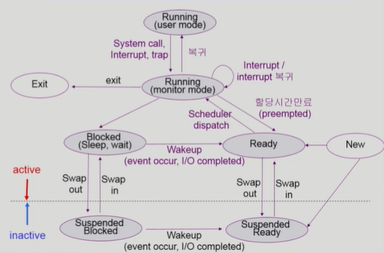
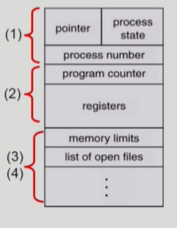
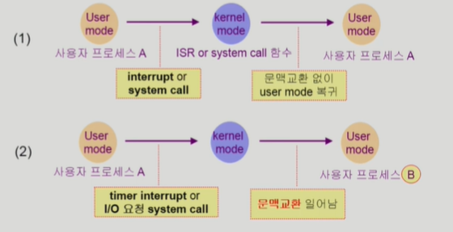
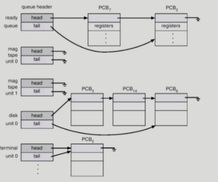
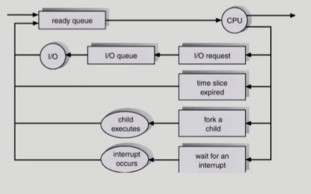

# Process1

## 프로세스의 개념
- Process is `a program in execution`(실행중인 프로그램)

- 프로세스의 문맥(context)
    - 특정 시점을 봤을 때 프로세스가 어디까지 실행되었고, 어디를 실행중인가. 즉, `현재 상태를 알기 위한 모든 요소들`.
    - 프로세스가 실행되면, 자신만의 주소 공간(code, data, stack으로 이루어짐)을 만든 후, CPU의 PC가 code를 읽어오며 연산을 수행한다.
    - 이걸 알기 위해서 다음이 필요하다.
        - CPU의 수행 상태를 나타내는 하드웨어 문맥
            - Program Counter
            - 각종 register
        - 프로세스의 주소 공간
            - code, data, stack
        - 프로세스 관련 커널 자료 구조(운영체제가 프로세스 제어 위해 할당한 공간)
            - PCB(Process Control Block)
                - 프로세스가 실행되면 커널에는 프로세스 제어를 위한 공간이 할당되고, 그게 PCB.
                - 커널 주소공간의 data영역에 있음.
            - Kernel stack
                - 시스템 콜을 했을 때 커널이 작업을 수행하며 함수 호출 등이 일어나 스택이 쌓인다. 그런데, 커널은 모든 프로세스가 공유하므로 각 프로세스별로 스택 공간을 구분해 두어야 한다.
                - 커널 주소공간의 stack에 있음.
- 현대의 운영체제는 time-sharing이라 여러 프로그램이 실행이 되므로 이러한 프로세스의 문맥을 백업해두지 않으면 다음 프로그램이 실행될 때, 문제가 생긴다.

## 프로세스의 상태

- 프로세스는 상태(state)가 변경되며 수행된다.
    - Running
        - CPU를 잡고 instruction을 수행중인 상태
    - Ready
        - CPU를 기다리는 상태(메모리 등 다른 조건을 모두 만족하고, 즉, 당장 필요한 부분이 메모리에 올라와 있는 등의 준비는 만족, CPU 제어권만 잡으면 됨)
    - Blocked(wait, sleep)
        - CPU를 주어도 당장 instruction을 수행할 수 없는 상태
        - Process 자신이 요청한 event(예 : I/O)가 즉시 만족되지 않아 이를 기다리는 상태
        - 예) 디스크에서 file을 읽어와야 하는 경우
    - Suspended(stopped)
        - 중기 스케줄러에 의해 추가
        - 외부적인 이유로 프로세스의 수행이 정지된 상태
        - 프로세스는 통째로 디스크에 swap out 된다.
        - (예) 사용자가 프로그램을 일시 정지시킨 경우(break key) 시스템이 여러 이유로 프로세스를 잠시 중단시킴(메모리에 너무 많은 프로세스가 올라와 있을 때)

- 보통, Running, Ready상태의 프로세스들을 번갈아 수행하며 time-sharing

- New : 프로세스가 생성 중인 상태
- Terminated : 수행(execution)이 끝난 상태. 끝나도 정리하는 작업이 필요해서 존재.

- Blocked는 CPU 입장에서 떠난거지 프로세스는 나름 본인의 일을 하고 있음, 반면 Suspended는 중기 스케줄러가 아얘 프로세스 중단시키고 압수한 상태.
### Blocked vs Suspended
- Blocked : 자신이 요청한 event가 만족되면 Ready
- Suspended : 외부에서 정지시킨 상태라 resume해주어야 Active
    - 중기 스케줄러가 프로세스 너무 많아 내린 경우, 외부는 중기 스케줄러
    - 사람이 break key 걸어 멈춘 경우는 외부가 사람.

- 다음은 추가된 상태도다.

- 주의) process가 Running(monitor mode)라고 해도 `프로세스가 kernel mode에서 running하고 있다`고 하지 운영체제가 running하고 있다고 하지는 않는다.
- 주의) 이러한 그림은 사용자 프로세스의 상태도를 나타내지 운영체제의 상태도를 나타내느 것은 아니다.
- suspended도 blocked에서 걸렸나, ready에서 걸렸나가 다르다.
- 점선 아래는 프로세스가 아얘 얼어붙은 상태, 위는 동작하는 상태.
- 그럼에도 suspended blocked에서 I/O completed같은 일이 걸리면 suspended ready같은 상태로 바뀔 수 있다.

- CPU는 하나의 process만 실행. 돌아가며 실행.
- running중 disk에서 뭔가 읽어야 한다면 프로세스는 blocked상태가 되어 Disk I/O queue에 쌓이고, 끝나면 Disk가 CPU에 interrupt걸어, 운영체제에 권한 넘어가고, 운영체제는 해당 프로세스의 데이터를 메모리에 넘겨주고, CPU의 Ready queue에 올리며 상태를 바꾼다.
- 물론, 그 반대도 가능하다. 프로세스가 필요하다면 blocked로 바뀌고, 다시 끝나면 돌아오고 한다.

- 하드웨어줄 뿐만 아니라 소프트웨어에도 줄이 있다. 공유 데이터 역시 어떤 프로세스가 사용 중일 때는 다른 프로세스는 큐에 쌓인다(blocked). 또, 한 작업이 오래 쓴다 싶으면 중간에 다시 queue로 들어가 쌓이고 한다. 작업이 끝나면 ready queue로 가서 다시 CPU 기다린다.

- 참고로 이런 큐들은 따로따로 떨어져 있지 않고, Kernel 주소 공간의 data 공간에 모두 있다.
- 실제로 큐는 우선순위큐다.

## Process Control Block(PCB)
- PCB
    - 운영체제가 각 프로세스를 관리하기 위해 프로세스당 유지하는 정보
    - 커널 주소 공간의 data부분에 존재.
    - 다음 구성요소를 가진다(구조체로 유지).
        1. OS가 관리상 사용하는 정보
            - Process state, Process ID
            - scheduling information, priority
        2. CPU 수행 관련 하드웨어 값
            - Program counter, registers
        3. 메모리 관련
            - Code, data, stack의 위치 정보
        4. 파일 관련
            - Open file descriptors...

## 문맥 교환(Context Switch)
- CPU를 한 프로세스에서 다른 프로세스로 넘겨주는 과정
- CPU가 다른 프로세스에게 넘어갈 때, 운영체제는 다음을 수행
    - CPU를 내어주는 프로세스의 상태를 그 프로세스의 PCB에 저장.
    - CPU를 새롭게 얻는 프로세스의 상태를 PCB에서 읽어옴.
    - CPU의 레지스터, Program Counter 정보, Memory map(메모리 위치 정보) 등...

- System call이나 Interrupt 발생 시 반드시 context switch가 일어나는 것은 아님.
    - 운영체제가 CPU를 같은 프로세스에 넘겨주는 것은 문제 없음. 그냥 user mode -> kernel mode -> user mode.
    - 반면 다른 프로세스로 넘어갈 때(timer interrupt or I/O system call)이면 문맥교환 일어남.
    - 물론, 프로세스가 다른 프로세스로 넘어가지 않아도(사진 위의 경우) CPU 수행 정보 등 context의 일부를 PCB에 저장해야 하지만, 문맥교환 하는 경우에는 그 부담이 크다(eg. cache memory flush).

## 프로세스를 스케줄링 하기 위한 큐
- Job queue : 현재 시스템 내에 있는 모든 프로세스의 집합
- Ready queue : 현재 메모리 내에 있으면서 CPU를 잡아서 실행하기를 기다리는 프로세스의 집합
- Device queues : I/O device의 처리를 기다리는 프로세스의 집합

- 프로세스들은 각 큐들을 오가며 수행된다.

- PCB가 줄 서 있는 모습이다.
- PCB에는 pointer가 있었는데, 그게 저렇게 연결 리스트 형성(큐 형성)에 쓰인다.

- 프로세스가 스케줄링되는 것을 나타낸 그림.
- 교재에서 잘못 설명된 것 : 인터럽트가 발생해도 ready queue로 가지 않음. CPU에 주도권을 잠깐 뺐겼을 뿐.

## 스케줄러(Scheduler)
- Long-term scheduler(장기 스케줄러 or job scheduler)
    - 메모리에 어떤 프로세스 줄지의 문제(어느게 ready상태가 되느냐).
    - 시작 프로세스 중 어떤 것들을 ready queue로 보낼지 결정
    - 프로세스에 memory(및 각종 자원) 주는 문제
    - degree of Multiprogramming(메모리에 프로그램을 몇개 올릴지, 이 프로그램에 메모리 줄지 안줄지)을 제어
        - 메모리에 프로그램이 너무 많이 올라가도, 적게 올라가도 시스템의 성능이 떨어진다.
    - time sharing system에는 보통 장기 스케줄러가 없음(무조건 ready, 즉, 무조건 메모리에 올린다.)
- Short-term scheduler(단기 스케줄러 or CPU scheduler)
    - 짧은 시간 단위로 변화해서 단기임.
    - 어떤 프로세스를 다음번에 running 시킬지 결정
    - 프로세스에 CPU 주는 문제
    - 충분히 빨라야 함(millisecond 단위)
- Medium-Term Scheduler(중기 스케줄러 or Swapper)
    - 여유 공간 마련을 위해 프로세스를 통째로 메모리에서 디스크로 쫓아냄
    - 프로세스에게서 memory를 뺏는 문제
    - degree of Multiprogramming을 제어
    - time-sharing은 이걸로 degree of Multiprogramming 제어

- 장기는 시작할 때 결정. 중기, 단기는 실행 중에도 결정.
