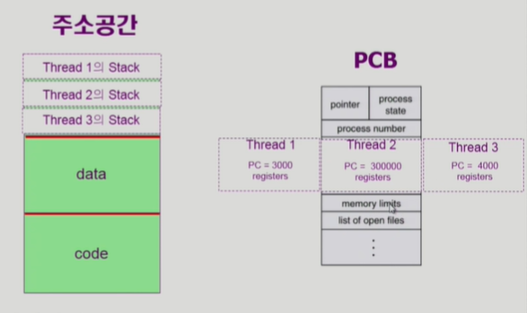
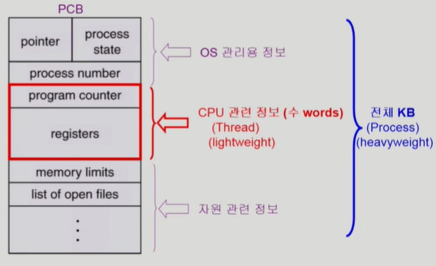

# Process 2

## 동기식 입출력 vs 비동기식 입출력
- 프로세스가 입출력을 요청하면 운영체제에 입출력을 요청한다.
- 입출력은 오래 걸린다. 이게 끝날 때까지 `프로세스가 기다리면(실행 멈추고 대기)` 동기식, 맡겨 놓은 후 `프로세스가 계속 동작`하면 비동기식.
- 동기식 입출력의 구현방법에는 입출력 때문에 멈춘 프로세스가 계속 CPU 점유하는 경우(즉, 그냥 낭비하는 방법)와, `프로세스의 권한 뺐고 다른 프로세스에 넘겨주는 법이 있고`, 우리들은 후자를 쓴다.

## Thread

- A `thread` (or `lightweight process`) is a basic unit of CPU utilization
- Thread의 구성
    - program counter
    - register set
    - stack space
    - CPU 실행에 쓰이는 부분, 각 thread별로 따로 가짐.
- Thread가 동료 thread와 공유하는 부분(=task)
    - code section
    - data section
    - OS resources
- 전통적인 개념의 프로세스인 heavyweight process는 하나의 thread를 가지고 있는 task로 볼 수 있다.

- 프로세스 내에 CPU 수행 단위가 여러개 있는 경우
- 프로세스가 하나 주어지면 code, data, stack의 주소 공간이 만들어지고, 프로세스를 관리하기 위해 PCB가 생긴다. 이 PCB에는 process state, program counter, registers 등 현재 메모리에 어느 부분을 실행하는 지, 어느 상태인지 저장된다.
- 만약 같은 일을 하는 프로세스가 여러개 있다면? 그것을 별도의 프로세스로 만들면 별도의 주소공간이 만들어지니 메모리의 낭비다. `그래서 이 때는 주소 공간은 하나만 띄우고, 각 프로세스마다 다른 부분의 코드를 수행할 수 있게 하면 좋고, 이것이 thread다.` 그래서 주소 공간은 하나만 두고, PCB에 각 thread별로 Program Counter와 register를 만들어 서로 다른 부분을 작동하게 한다. 한편, 함수를 호출할 경우, stack에 쌓이기도 하니, 주소공간의 stack도 thread별로 나눈다. 즉, CPU 실행에 쓰는 곳만 나누고, 나머지는 공유한다.

### 장점

- 다중 스레드로 구성된 태스크 구조에서는 `하나의 서버 스레드가 blocked(waiting) 상태인 동안에도 동일한 태스크 내의 다른 스레드가 실행(running)`되어 빠른 처리를 할 수 있다.
    - 예를 들어, 웹 브라우저를 다중 스레드로 구현하면 한 스레드가 서버로부터 데이터를 읽어 오는 동안, 또다른 스레드가 화면을 처리해 보여주는 등의 일을 할 수 있다.
- `동일한 일을 수행하는 다중 스레드가 협력`하여 `높은 처리율`(throughput)과 성능 향상을 얻을 수 있다.
- 스레드를 사용하면 `병렬성을 높일 수 있다`.
    - 같은 프로세스 내의 독립적 연산을 각 스레드들이 서로 다른 CPU에서 실행되는 방식을 이용해 병렬성이 높아진다.
- 자원 절약이 가능하다. 같은 일을 하는 프로세서를 여럿 띄우는 대신 하나의 프로세스 안에 여러 스레드를 두면 되기 때문이다.

- 여기서 CPU 관련 부분만 스레드마다 별도로 존재하게 된다.