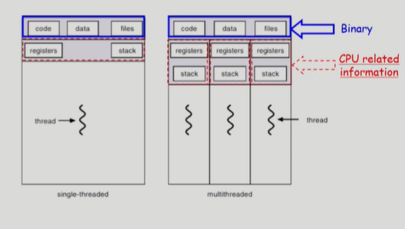

# Process 3

- 이렇게 스레드가 한개 있을 때랑 여럿 있을 때가 다르다.

## 스레드의 장점
- Responsiveness(응답성)
    - 사용자 입장에서 빠르다.
    - 웹브라우저가 여러 스레드를 가지고 있다면? 하나의 스레드는 서버에서 파일 들고 오는 동안(blocked상태) 다른 스레드는 도착해있는 문서를 띄우고 있다.
    - 즉, I/O작업 동안 프로세스를 멈추는 것이 아니라, 우선 읽어온 html부터 화면에 띄우도록 하는 것이다. 즉, `비동기식 입출력`이 구현되는 것이다.
- Resource Sharing(자원 공유)
    - 똑같은 일 하는 프로세스를 여럿 띄우기 보다는 한 프로세스에 여러 스레드 만들어 code, data, resource를 공유하는게 더 효율적.
- Economy(경제성)
    - 빠르다는 의미.
    - overhead : 프로그램 실행에 드는 추가적인 시간, 메모리, 자원 등
    - 프로세스를 하나 만드는데 드는 overhead는 크다. 반면, 스레드 추가는 overhead가 그리 크지 않다.
    - context switching은 overhead가 크지만, 프로세스 내부에서 스레드간의 CPU 스위치는 동일한 주소 공간을 사용하므로 변경할 문맥이 적어 간단해진다.
    - 예시로, Solaris 운영체제의 경우 overhead를 비교하면 스레드하나 생성보다 프로세스 생성이 30배, 스레드 전환보다 프로세스 전환이 5배 더 든다.
- Utilization of MP(MultiProcessor) Architectures
    - CPU가 여러개 있는 경우, 각 스레드가 서로 다른 CPU에서 병렬적으로 일해서 더 빠른 결과를 얻을 수 있다.

## 구현법
- 어떤 스레드는 kernel의 지원을 받고(kernel threads), 어떤 스레드는 library의 지원을 받아 만들어진다(User threads).
- 커널 스레드는 `운영체제가 다중 스레드를 알고 있어서` 하나의 스레드에서 다른 스레드 넘어가는 것도 커널이 프로세스 넘기듯 해준다.
- 유저 스레드는 `여러 스레드 있는 것을 운영체제는 모르고` 사용자 프로그램이 알아서 관리해준다. 즉, 커널의 눈에는 일반적 프로세스나, 프로세스가 내부에 여러 수행 단위를 구현한 것이라 구현상의 제약점이 존재한다.
- 몇몇은 real-time기능 지원하는 real-time thread다.