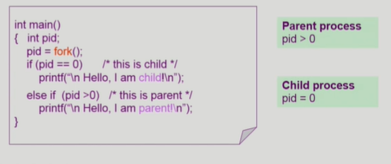
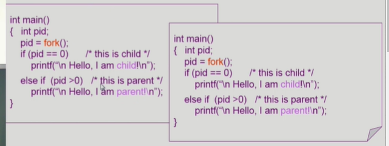
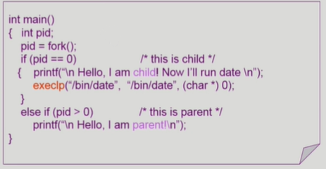
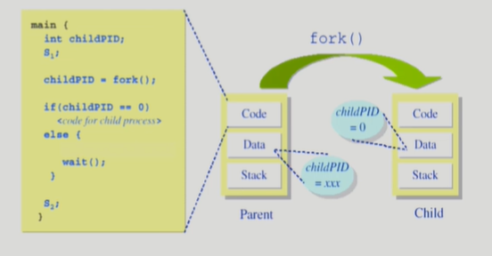
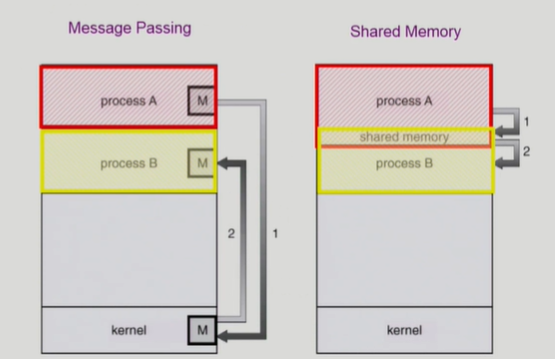
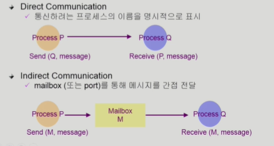
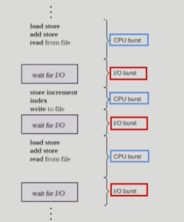
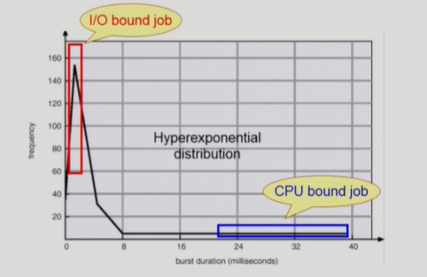

# Process Management 2

## 지난시간 복습
- 부모 프로세스가 자식 프로세스를 생성
- 부모 프로세스의 주소공간, PC 등의 문맥을 그대로 복사해 자식 프로세스 만들면서 프로세스가 생성된다.
- 대부분 부모와 자식은 자원을 공유하지 않는다.
- 공유 개념이 나온 이유는 일단 copy한 내용은 같으므로, linux같은 몇몇 운영체제에서는 `일단 모두 copy하지 않고 자식이 부모와 주소공간 공유하고, Program Counter만 다르게 하다가 나중에 달라지는 부분이 생기면 필요한 것(예: 주소공간의 일부)을 copy해 본인 것으로 만든다.` 이를 `Copy-on-write(COW)`라고 한다. 즉, write가 발생하면 그 때서야 copy한다는 의미다.
- 새로운 프로세스 생성은 `fork()` 시스템 콜, 복제 생성 후 새로운 프로그램을 덮어 씌울 때는 `exec()` 시스템 콜.

## fork() 시스템 콜

- 새로운 프로세스 생성.
- 위에서부터 실행된다.
- 빨간 fork()는 fork 시스템 콜, return value가 pid에 저장된다. 이 때, 이 main에 해당하는 프로세스를 그대로 복제한 자식 프로세스가 생긴다. 

- 복제 후, 부모든 자식이든 fork()부분 다음부터 코드를 실행한다(이렇게 안 하고 자식이 처음부터 하면 자식도 fork()만나서 실행되고, 또 되고, 무한 복제겠죠?).

- 근데, 어느게 자식 프로세스고 어느게 부모 프로세스인지 어떻게 구분할까? 또, 그대로 복제했다면 똑같은 제어 흐름 타야 된다. 이러면 의미없다.
    - 이를 방지하기 위해 pid라는 리턴 값을 사용한다. 자식 프로세스는 pid가 0이고, 부모 프로세스는 pid > 0 이 된다. 서로 다른 return value를 가짐으로써 서로 다른 일을 할 수 있도록 만들어줄 수 있다.

- 새로운 가정: 만약 fork전에 printf 구문이 있었다면? 부모 프로세스는 해당 부분을 실행할 수 있으나, 자식 프로세스는 실행 못한다. fork 다음부터 실행하기 때문이다.

## exec() 시스템 콜
- 어떤 프로그램을 완전히 새로운 프로세스로 태어나게 해준다.

- 빨간색 execlp가 exec 시스템 콜을 불러온다.
- 불러오게 되면 지금까지의 프로그램은 잊고, 새로운 프로그램을 덮어쓰며 프로세스가 다른 프로그램으로 바뀐다. 이 코드에서는 date라는 프로그램으로 자식 프로세스가 바뀐다.

- 근데, 꼭 새 프로그램을 실행시키기 위해서 fork를 해야 할까? 아니다. 그냥 원래 프로그램에 fork를 걸어서 덮어써도 된다. 기존 프로그램의 내용은 소실되지만, 어쨌든 다른 프로그램 실행은 가능하다.
- exec 이후의 구문은 실행 불가능하다.
- `execlp("프로그램 이름", ..."프로그램 arguments", (char *) 0);` <- 리눅스.

## wait() 시스템 콜

- 프로세스 A가 wait() 시스템 콜 호출하면,
    - child가 종료될 때까지 프로세스 A를 block상태로 만든다.
    - child process가 종료되면 커널은 프로세스 A를 깨운다(ready 상태).

- 위의 코드는 fork 후, 부모 프로세스가 wait함수를 만나게 해 block시키고, 자식 프로세스가 종료되어야 다음 구문부터 실행 가능하다.
- 이것은 자식이 종료될 때까지 부모가 기다리는 모델에 적용된다.
- 대표적으로 linux shell에서 프로그램 A를 실행시키기 위해 enter를 치면 shell은 wait가 걸리고, 프로그램 A가 자식 프로세스로 생성되어 실행된다. shell은 자식 프로그램이 끝날 때까지 기다리다 끝나야 기동된다.

## exit() 시스템 콜
- 프로세스의 종료에 사용
    - 자발적 종료
        - 마지막 statement 수행 후 exit() 시스템 콜
        - 프로그램에 명시적으로 적어 주지 않아도 main함수가 return되는 위치에 컴파일러가 넣어준다.
    - 비자발적 종료
        - 부모 프로세스가 자식 프로세스를 강제 종료시킴
            - 자식 프로세스가 한계치를 넘어서는 자원 요청
            - 자식에게 할당된 태스크가 더 이상 불필요.
        - 키보드로 kill, break 등 침.
        - 부모가 종료하는 경우
            - 부모 프로세스가 종료하기 전에 자식들이 먼저 종료됨.

- 프로그램에 넣을 수도 있고, 컴파일러가 자동으로 넣기도 한다.

## 정리
- fork()
- exec()
- wait()
- exit()

## 프로세스 간 협력

- 독립적 프로세스(Independent process)
    - 프로세스는 각자의 주소 공간을 가지고 수행되므로 원칙적으로 하나의 프로세스는 다른 프로세스의 수행에 영향을 미치지 못함.
- 협력 프로세스(Cooperating process)
    - 프로세스 협력 메커니즘을 통해 하나의 프로세스가 다른 프로세스의 수행에 영향을 미칠 수 있음
- 프로세스 간 협력 메커니즘(IPC : InterProcess Communication)
    - 메시지를 전달하는 방법
        - `message passing` : 커널 통해 메시지 전달
    - 주소 공간 공유하는 방법
        - `shared memory`: 서로 다른 프로세스 간에도 일부 주소 공간을 공유하게 하는 shared memory 메커니즘이 있음.

- thread의 경우, 사실상 하나의 프로세스이므로 프로세스 간 협력으로 보기는 어렵지만 동일한 process를 구성하는 thread들 간에는 주소 공간을 공유하므로 협력 가능.

## Message Passing

- Message system
    - 프로세스 사이에 공유 변수(shared variable)을 일체 사용하지 않고 통신하는 방법.

- Direct Communication 
    - 통신하려는 프로세스의 이름 명시적으로 표시
- Indirect Communication
    - mailbox(또는 port)를 통해 메시지를 간접 전달.
    - 보내려는 프로세스 말고 다른 프로세스도 받을 수 있다는 단점.
- 주의) 둘 다 커널을 통해 메시지 주고 받는다. 직접 못한다.

## Shared Memory
- 원칙적으로 두 프로세스는 서로 공유해서는 안되나, memory를 shared할 수 있도록 만들어준 형태.
- kernel한테 shared memory한다고 해서 해당 memory를 mapping하는 방식으로 할 수 있다.
- 일단, 한번 kernel이 이런걸 만들어주면 이제 앞으로는 둘 끼리 통신하며 잘 쓰면 된다.
- 만약 한쪽에서 이 부분 잘못 쓰면 상당히 큰 문제가 생긴다.

# CPU Scheduling

- 프로그램은 CPU만 연속적으로 사용하며 instruction을 실행하는 단계(CPU burst)와 I/O를 기다리는 단계(I/O burst)를 반복하며 진행된다. 이 빈도와 길이는 프로그램마다 다르다.
- 사람과 interaction하는 프로그램이 보통 이 과정이 여러번 반복되며 진행된다.
- 반면 과학 계산 같은 것은 오랫동안 CPU burst를 진행하는 종류의 프로그램이다.

## CPU burst time

- 위는 CPU burst time의 분포를 그려넣은 것이다.
- 중간에 I/O가 끼어드는 작업이(I/O bound job) 빈도가 높았고, CPU를 길게 쓰는 작업(CPU bound job)의 빈도는 비교적 낮았다.
    - 하지만 이 통계는 함정이다. 실제로는 CPU bound job은 CPU가 오래 점유하니 빈도가 낮게 보이고, I/O bound job은 개별 CPU 점유 시간은 낮으나 자주 걸리니 빈도가 높게 보인다.
    - 요점은 여러 종류의 job이 섞여 있다.
    - 근데, 여기서 우리는 I/O bound job에 주목해야 한다. 이러한 작업은 사람과 interaction하는 job이기 때문에 CPU bound job이 너무 오래 잡고 있으면 매우 불편하다.
- 여러 종류의 job(=process)이 섞여 있기 때문에 CPU 스케줄링이 필요하다.
    - interactive job에게 적절한 response 제공 요망
    - CPU와 I/O 장치 등 시스템 자원을 골고루 효율적으로 사용.

## 프로세스의 특성 분류
- 프로세스는 다음 두 가지로 나뉜다.
    - I/O-bound process
        - CPU를 잡고 계산하는 시간보다 I/O에 많은 시간 필요한 job
        - many short CPU bursts
    - CPU-bound process
        - 계산 위주의 job
        - few very long CPU bursts

## CPU Scheduler & Dispatcher
- CPU Scheduler
    - Ready 상태의 프로세스 중, 이번에 CPU를 줄 프로세스를 고른다.
    - 운영체제 안에 있는 코드의 일부분이다.

- Dispatcher
    - CPU의 제어권을 CPU scheduler에 의해 선택된 프로세스에게 넘긴다.
    - 이 과정을 context switch(문맥 교환)라고 한다.

- CPU 스케줄링이 필요한 경우는 프로세스에게 다음과 같은 상태 변화가 있는 경우이다.
    1. Running -> Blocked(예: I/O 요청하는 시스템 콜)
    2. Running -> Ready(예: 할당시간만료로 timer interrupt)
    3. Blocked -> Ready(예: I/O 완료 후 인터럽트)
        - 주의: ready상태니 바로 얻는게 아니라 대기 중인 거임. 원래 하던 process가 있으면 일반적으로는 interrupt 처리 후 원래 process를 처리하나, 만약 `priority`가 있고 이번에 I/O 끝났던 process가 `우선순위가 제일 높은` 상태였다면 `CPU scheduling을 사용해 바꿔야` 된다.
    4. Terminate

- 1, 4에서 스케줄링은 `nonpreemptive(=강제로 빼앗지 않고 자진 반납)`
- All other scheduling is `preemptive(=강제로 빼앗음)`