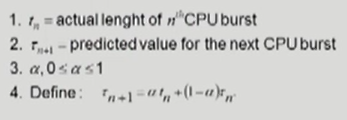

# CPU Scheduling 1

## 복습

-   컴퓨터 프로세스이 실행될 때는 `CPU 작업과 오래 걸리는 I/O를 처리하는 작업을 반복한다`. `CPU-burst`(CPU를 한번 사용하는 시간)을 보면 대부분 짧은 단위이고(I/O 때문에), 긴 경우도 조금 있었다.
-   컴퓨터 프로세스의 패턴은 CPU를 길게 점유하는 것과 짧게 점유하는 것이 섞여 있다. 그래서 CPU 스케줄링이 중요하다.
    -   특히, CPU burst가 짧은 I/O bound job의 경우, 사람과 interaction하는 job이 많으므로, 이런 job에 CPU를 너무 늦게 주면 응답시간이 길어져 답답해진다.
-   `CPU 스케줄링`은 `ready queue에 있는 작업 중 어떤 작업에 줄지 결정하는 것`이다. CPU는 하나이므로 여러 작업 중 하나를 결정해야 한다.
    -   크게 두가지 이슈가 있다. `누구한테 당장 줄 것인가?` CPU를 줬으면 `이 프로세스이 다 쓸 때까지 기다리느냐`, `중간에 뺐어서 다른 프로세스에 넘겨주느냐`?
    -   특히 두번째 이슈에서 다 쓸 때까지 보장해 준다고 하면, `CPU-burst가 긴 작업(CPU bound job)이 너무 길게 점유해 CPU를 금방 쓰고 나갈 job(I/O bound job)의 대기 시간이 길어진다`. 이러한 경우, `I/O bound job의 대기 시간이 적도록 스케줄링` 해야 한다. 공평성도 중요하지만 효율성도 중요하다.

## CPU 스케줄링 알고리즘

-   크게 두 가지 방식이 있다.
    -   `Non-preemptive(비선점형)` : 프로세스이 CPU를 얻었으면 `자진 반납 전까지 회수 안함`.
    -   `Preemptive(선점형)` : 프로세스이 작업하는 중에 timer 등을 이용해 `강제로 빼았는 방식`. 현대적인 CPU 스케줄링 방식.
-   FCFS(First-Come First-Served), SJF(Shortest-Job First), SRTF(Shortest-Remaining-Time-First), Priority Scheduling, RR(Round Robin), Multilevel Queue, Multilevel Feedback Queue
-   CPU 스케줄링 알고리즘의 성능 척도(Scheduling Criteria, Performance Index, Performance Measure, 성능 척도)
    -   `시스템 입장`에서의 성능 척도 : `CPU가 최대한 일을 많이` 하는 것.
        -   `CPU utilization(이용률)` : 전체 시간 중 CPU가 일한 시간 비율(높을수록 좋다)
        -   `Throughput(처리량)` : 주어진 시간동안 몇 개의 작업을 처리했는가?(높을수록 좋다)
    -   `프로세스 입장`에서의 성능 척도 : `프로세스이 빨리 처리`되면 좋은 것. 시간 관련. 고객 관점.
        -   `Turnaround time(소요시간, 반환시간)` : CPU를 쓰러 들어와서 다 쓰고 나갈 때까지 걸린 시간. Ready Queue에 들어와 기다린 시간 + CPU를 얻어 쓰고 나갈 때까지 걸린 시간.
        -   `Waiting time(대기 시간)` : 기다린 시간. CPU를 쓰기 위해 ready queue에 기다린 시간.
        -   `Response time(응답 시간)` : Ready Queue에 들어와서 '처음으로' CPU 얻기까지 걸린 시간.
-   Waiting time vs Response time vs Turnaround time

    -   모든 기준은 `CPU-burst를 기준`으로 한다.
    -   선점형인 경우, CPU를 얻었다 뺐겼다 얻었다 뺐겼다를 반복한다. 이 `대기 시간을 모두 합친 것`이 `Waiting time`.
    -   `Response time`은 들어와서 `응답을 '처음으로' 얻을 때까지` 걸린 시간이다. `완료가 아니다`. time sharing에서는 사용자가 처음 응답을 받는 상황이니 중요하다.
    -   `Turnaround time`은 `들어와서 쓰고 기다리고 반복하다 나갈 때까지의 모든 시간`이다.
        -   메모리 들어가기 위해 기다린 시간, ready queue에서 대기한 시간, CPU 실행 시간, I/O 시간 총합이다.

## 스케줄링 알고리즘

### FCFS(First-Come First-Served)

-   먼저 온 고객을 먼저 처리. 즉, `먼저 온 순서`대로 처리하는 것.
-   `비선점형` 스케줄링.
-   별로 효율적이지 못하다. 만약, `CPU 오래 쓰는 프로세스이 먼저 들어와 점유`하면, 나머지는 짧게 써야 하는데도 오래 기다려야 한다.
    -   반대로 빠른 프로세스이 먼저 들어와 점유하면 waiting time이 짧아진다. 즉, `들어오는 순서에 따라 결과 차이가 크다`.
    -   이렇게 `긴 프로세스이 먼저 들어와 오래 기다리는 현상`을 `Convoy effect`라고 한다.

### SJF(Shortest-Job-First)

-   `CPU를 사용하고자 하는 시간(CPU burst)가 짧은 프로세스`에 CPU를 주는 방식이다.
-   주어진 프로세서들에 대해 `minimum average waiting time을 보장`한다. 정확히는 `preemptive한 SRTF`가 이를 보장한다.
-   여기도 Nonpreemptive, Preemptive 방식 2가지가 있다.
    -   `Nonpreemptive`는 더 짧은 프로세스가 들어와도 `한번 준 CPU 사용권을 회수하지 않는다`.
    -   `Preemptive`한 방식은 프로세스가 들어왔을 때, 현재 `수행중인 프로세스의 남은 burst time과 비교`해 만약 `새로 들어온 것이 짧으면 CPU를 회수해 새 프로세스`에 준다. `Shortest-Remaining-Time-First(SRTF)`라고도 한다.
-   이 알고리즘에도 문제점이 있다.
    -   `Starvation(기아 현상)` : SJF는 극단적으로 CPU 사용 시간이 짧은 job을 좋아한다. 그래서 만약 계속 CPU 사용 시간이 짧은 job이 들어오면, `CPU 사용 시간이 긴 job이 계속 대기하며 영원히 실행되지 않는 문제`가 생긴다.
    -   `CPU 사용 시간을 미리 알 수 없다는 문제`도 있다. 중간에 I/O 등이 관여하므로, `실행 전에는 수행 시간을 알 수 없다`.
        -   물론 `시간 추정`이 가능하다. `과거의 CPU 사용 흔적을 통해 예측`할 수는 있다. 주로 `exponential averaging방식`을 이용한다.
        -   
        -   알파가 0이면 예측값을 무시하고, 알파가 1이면 최근의 CPU 사용량만 남는다. `(1-a)가 계속 곱해지면서 오래된 값의 가중치가 점점 작아지고, 최근의 값이 좀 더 높게 다루어진다`.

### Priority Scheduling

-   우선순위 스케줄링. `우선순위가 제일 높은 프로세스`이 CPU를 준다.
-   Preemptive, Nonpreemptive 방식 2가지로 나뉜다.
    -   `Nonpreemptive` 방식은 따로 중간에 회수 안한다.
    -   `Preemptive`는 중간에 우선순위 높은 프로세스 들어오면 빼았는다.
-   보통 프로세스에는 우선순위가 있고, 보통 integer로 주어지며, 높을수록 숫자가 작다.
-   SJF도 CPU 사용 시간이 작은 것에 우선순위를 높게 주는 일종의 우선순위 스케줄링이다.
-   `Starvation`문제가 발생할 수 있다. `우선순위가 낮은 프로세스이 계속 실행되지 않는 문제`다.
    -   이를 해결하기 위해 `Aging(노화) 기법`을 활용한다. `오래 기다린 프로세스의 우선순위를 높여주는 방식`이다.

### Round Robin(RR)

-   `현대적인 CPU가 일반적으로 쓰는 스케줄링`
-   `Preemptive`방식이다. 할당 시간을 주고, 돌아가며 쓰는 방식이다.
    -   `할당 시간(time quantum)`을 주고 CPU들이 해당 시간 동안만 사용하며 돌아가며 수행된다.
    -   장점은 `응답 시간이 빨라진다`. 누구든 조금만 기다리면 사용 가능하다. 또, `예측할 필요 없이 그냥 빨리 나갈 수 있는 애는 빨리 쓰고 나갈 수 있다`.
    -   CPU를 길게 쓰는 프로세스는 기다렸다 실행되었다를 반복하니 대기 시간이 길어지고, 반대로, 짧게 쓰는 프로세스는 짧게 쓰고 바로 끝내니 대기를 한번만 해도 된다. 즉, `사용 시간과 대기 시간이 비례`한다.
-   n 개의 프로세스가 ready queue에 있고, 할당 시간이 q time unit인 경우, 각 프로세스는 최대 q time unit단위로 CPU 시간의 1/n을 얻고, `어떤 프로세스도 (n-1)q time unit 이상 기다리지 않는다`.
-   성능
    -   `q가 크면 FCFS와 다를바 없다`.
    -   `q가 작으면 round robin 철학 상으로는 이상적이나, context switch로 오버헤드가 커진다`.
    -   적당한 규모의 time quantum이 좋고, `10~100ms`가 일반적이다.
-   일반적으로 SJF보다 `average turnaround time은 길지만`, `response time은 짧다`.
-   CPU 사용 시간이 다양한 경우 쓰기 좋고, 반대로 모두 비슷한 경우, 모든 프로세스가 거의 동시에 끝난다. 하나씩 줬으면 먼저 끝내고 빠져나갈 수 있었을텐데, 대기 시간만 길어진다.
    -   하지만, 대부분의 경우 `사용 시간이 다양하므로(heterogeneous)` 이게 효과적이다.
    -   사용 시간이 비슷하다면 time quantum을 크게 잡으면 성능이 나아진다. FCFS처럼 동작하기 때문이다.
