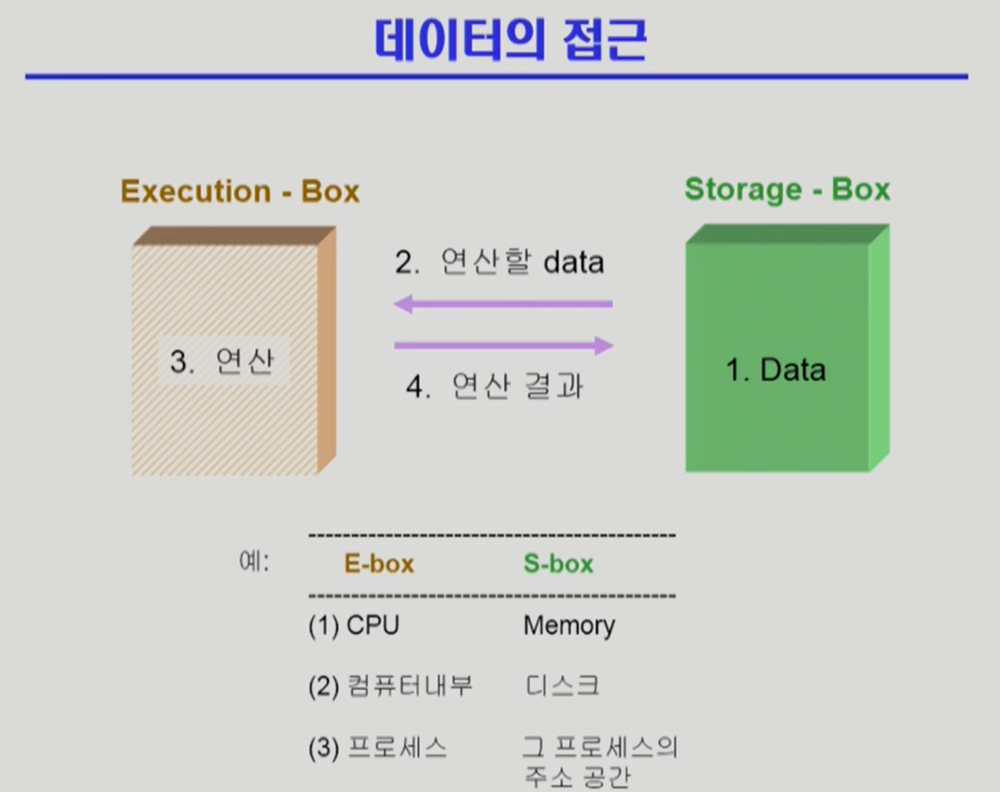

# CPU Scheduling 2 / Process Synchronization 1

## 복습

-   `컴퓨터 시스템 안의 job은 여러 종류`이기에 `CPU 스케줄링이 필요`하다.
-   FCFS는 `CPU 오래 사용하는 프로세스가 먼저 사용권을 얻으면 짧게 사용하는 프로세스들이 너무 비효율적`으로 동작한다.
-   이 후, 다양한 알고리즘이 등장했고, `Round Robin이 현재는 주로 통용`된다. 특히, I/O bound job(CPU 짧게 사용)은 바로 사용하고 빠져나가고, 오래 사용하는 job은 CPU를 얻었다 뺐었다를 반복한다. 즉, CPU 사용 시간이 사용하려는 시간과 비례한다.
    -   Round Robin은 CPU 컨텍스트를 저장했다, 나중에 다시 불러와 `중간부터 실행 가능하기에 비로소 도움`이 된다.

## CPU Scheduling(이어서)

### Multilevel Queue

-   지금까지 ready queue는 한 줄이었다. 즉, 줄을 한 줄로만 섰다. 이제 이 multilevel queue, multilevel feedback queue는 `줄이 여러개가 된다`.
    
-   multilevel queue의 모습이다. 위로 갈수록 우선순위가 높은 줄이다. CPU가 하나라고 가정할 때, 이 줄에서 하나의 job만이 실행될 것이다.
-   가장 우선순위가 높은 것은 시스템과 관련된 프로세스, 그 다음이 사람과 상호작용하는 프로세스다. Batch process는 낮은 우선순위다.
-   이 줄은 철저한 계급제다. 본인에게 해당하는 줄에 서고, `우선순위가 높은 job부터 실행되며, 해당 우선순위의 job이 다 처리되면, 그 다음 줄로 넘어간다`.
-   process를 `어느 줄에 넣을 것`인가, 우선순위 높은 줄에만 우선권을 주면 `starvation`이 일어날 가능성이 있는데 어떻게 처리하느냐의 문제가 있다.
    -   이를 해결하는 몇 가지 방법이다.
    -   우선, `foreground queue, background queue`로 분할한다. `foreground는 사람과 상호작용 하는 job`이고, `background queue는 batch작업, 즉, 사람과 상호작용이 없는 job`이다.
    -   `foreground queue`에는 `RR`를 써서 응답시간을 줄이고, `background queue`에는 굳이 응답시간이 빠를 필요 없으니 `FCFS`를 사용한다. 즉, `각 큐별로 독립적 스케줄링 알고리즘`을 사용한다.
    -   이제 `큐에 대한 스케줄링`을 진행한다. 2가지 방식을 들 수 있다.
        -   `Fixed priority scheduling`의 경우, `foreground에 있는 job이 다 실행되고 난 뒤에야 background로` 넘어간다. `starvation`의 위험이 있다.
        -   `Time slice`의 경우, 각 큐에 `CPU time을 적절한 비율로 할당`한다. 예를 들면, `foreground에 80%, background에 20%` 같은 방식이다.
-   즉, RR과 달리 공정하지 않고, 차별적이다. 물론, 일에는 우선순위가 있으니 어쩔 수 없다.

### Multilevel Feedback Queue

-   여기서는 줄이 왔다갔다할 수 있다.
-   우선순위가 낮은 작업이 평생 낮은 것은 그러니, 이동이 가능하다. `aging`을 이와 같은 방식으로 구현 가능하다.
-   `큐의 개수, 각 큐의 스케줄링 알고리즘, 프로세스의 큐 이동 기준, CPU가 어느 큐를 처리할 것인가`의 문제가 있다.
-   일반적으로 운영하는 방식은 다음과 같다. `우선 처음 들어오는 프로세스는 우선순위 높은 큐`에 주고, 우선순위 높은 큐는 `time quantum이 짧은 RR방식`이다. 그리고, 처리가 안되면 그 아래 큐로 이동하는데, `time quantum이 더 긴 RR`, 그 다음... 이렇게 반복되다가 마지막은 `FCFS`로 동작하는 queue다.
    -   일반적으로 위의 큐가 다 처리되어야 밑의 큐가 처리된다.
    -   즉, 빨리 끝날 작업은 빨리 끝나나, 길게 걸리는 작업은 점점 우선순위가 아래로 내려간다. `사용 시간이 짧은 job이 엄청 큰 우선순위를 갖는다`.
    -   사용시간 예측이 필요 없다. `짧은 프로세스가 자연스럽게 우선순위를 높게 가져간다`.

### Multiple-Processor Scheduling

-   지금까지는 CPU가 한 개인 경우다. 이제는 `여러 CPU가 존재`할 때의 스케줄링이다. 더욱 복잡해진다.
-   `Homogeneous processor`의 경우
    -   큐에 한줄로 세워 각 프로세서가 알아서 꺼내가게 할 수 있다.
    -   반드시 특정 프로세서에서 수행되어야 하는 프로세스가 있으면 문제가 복잡해진다.
-   `Load sharing`
    -   일부 프로세서에 job이 몰리지 않도록 부하를 적절히 공유하는 메커니즘이 필요하다.
    -   별개의 큐를 두는 방법 vs 공동 큐를 사용하는 방법
-   `Symmetric Multiprocessing(SMP)`
    -   모든 CPU가 대등하다 볼 수 있다.
    -   `각 프로세서가 각자 알아서` 스케줄링 결정
-   `Asymmetric multiprocessing`
    -   `하나의 프로세서가 시스템 데이터의 접근과 공유를 책임`지고 `나머지 프로세서는 거기에 따름`
    -   즉, `하나의 CPU가 일 분배하는 역할을 하고, 나머지는 거기에 따른다`.

### Real-Time Scheduling

-   `데드라인이 있어 그 안에 무조건 실행`되어야 하는 job이다. 즉, 무조건 `그 시간 내에 처리가 끝나도록 보장`해야 한다.
-   `그 때 그 때 처리하기 보다는 미리 스케줄링을 해서 적재적소에 배치`하는 방식이다.
-   `periodic`한 일도 많아서 `주기적으로 실행`되어야 하고, 그 `실행 시간을 보장`받아야 하는 경우도 있다.
-   `Hard real-time systems`
    -   `무조건 그 시간내에 끝내도록` 스케줄링 해야 하는 job이다.
-   `Soft real-time systems`
    -   그정도 까지는 아닌 job이다. `일반 프로세스에 비해 높은 priority`를 갖도록 해야 한다.

### Thread Scheduling

-   `프로세스 하나 안에 있는 여러 CPU 실행 단위가 Thread`다.
-   `Local Scheduling`
    -   `User level thread`(사용자 프로세스가 직접 thread를 관리하고, 운영체제는 이를 모르는 경우)의 경우, `사용자 수준의 thread library에 의해 어떤 thread를 스케줄`할 지 결정.
    -   즉, `사용자 프로세스`가 스케줄링을 한다.
-   `Global Scheduling`
    -   `Kernel level thread`(운영체제가 프로세스 thread를 관리하는 경우)의 경우, 일반 프로세스와 마찬가지로 `커널의 단기 스케줄러가 어떤 thread를 스케줄`할지 결정

### Algorithm Evaluation

-   알고리즘의 평가도 중요하다.
-   `Queueing models`
    -   
    -   `이론적`인 방법.
    -   `server는 CPU`다.
    -   프로세스가 도착하는 `도착율(arrival rate)`과 서비스 처리 결과인 `처리율(service rate)`가 확률 분포에 따라 `주어졌을 때`, `CPU의 throughput이나 waiting time 등을 계산해 처리`하는 방식이다.
    -   `과거`에 많이 썼지만, 최근에는 실제 시스템을 중요하게 생각해 덜 쓰인다.
-   `Implementation(구현) & Measurement(성능 측정)`
    -   `실제 시스템`에 알고리즘을 구현하여 `실제 작업(workload)`에 대해 `성능을 측정 비교`
    -   실제 구현해야 하니 `어렵다`.
-   `Simulation(모의 실험)`
    -   알고리즘을 `모의 프로그램으로 작성`한 후, `trace를 입력`으로 하여 결과 비교
    -   즉, `예제와 도착 시간, Burst time같은 것이 주어지면 알고리즘에 따른 동작 순서가 결정될 것`이다. 복잡한 알고리즘의 경우 `손 계산이 어려울 것`이다. 이를 대신하는 `프로그램을 구성해 시뮬레이션을 돌려본다`.
    -   예제 하나만 두고 내 알고리즘이 좋다고 하면 안좋겠죠? `실제 프로그램에서의 데이터를 추출해(trace)` 시뮬레이션에 넣고 돌리면 좋을 것이다.

## Process Synchronization

### 데이터의 접근

-   컴퓨터 시스템에서 데이터 접근의 패턴은 다음과 같다.
    

1. 데이터를 저장하는 곳과 연산하는 곳이 있다.
2. 연산할 data를 저장위치로부터 꺼낸다.
3. 연산을 한다.
4. 연산 결과를 data 저장 위치로 반환한다.

-   이 과정에서 Process Synchronization 문제가 생긴다.
    -   데이터를 읽어오고 반환하는 과정에서 문제가 생긴다.
-   저장 공간을 여러 실행 단위가 사용한다 생각하자.
    -   
    -   누군가는 해당 데이터를 증가, 누군가는 반대로 감소시키려고 한다. 누군가 데이터를 증가시키려고 가져온 사이에 변하기 전의 데이터에 접근해 감소시킨다. 그러면 문제가 발생한다.
    -   이렇게 `같은 data를 여럿이 거의 동시에 접근해서 발생하는 문제를 Race condition`이라 한다. - 여기서 연산 공간은 컴퓨터 내부나 프로세스가 될 수 있고, 저장 공간은 디스크나 그 프로세스의 주소 공간이 된다.
-   그런데, CPU가 1개고, 프로세스는 원래 본인 주소 공간만 접근하니 문제가 없을 것 같다.
    -   하지만, CPU를 여러개 사용하는 `Multiprocessor system`의 경우, 또는 `공유메모리를 사용하는 프로세스들`이나 `커널 내부 데이터를 접근하는 루틴들 간`(예를 들면, 커널모드 수행 중 인터럽트로 커널모드 다른 루틴 수행 시)에 문제가 생길 수 있다.
        -   즉, 어느 프로세스가 커널 모드로 가서 동작을 하던 중, 다른 프로세스가 실행되고, 그 프로세스도 커널 모드로 간 경우. 커널 모드 수행 중 인터럽트로 인해 다른 것을 처리할 때 문제가 생긴다.

### race condition이 생기는 경우

1. `kernel 수행 중 인터럽트 발생 시`
    - 
    - 운영체제 커널이 실행되며 count라는 값을 1 증가시키고 있다. 메모리의 count를 레지스터로 불러와, 증가시키고, 다시 메모리에 저장한다.
    - 그런데, 그 도중에 인터럽트가 들어왔다. 작업이 중단되고 인터럽트 핸들러로 처리한다. 물론 인터럽트 핸들러도 커널의 코드다. 즉, kernel address space를 공유한다.
    - 이 인터럽트는 count를 감소시키고 저장한다. 그 후, 다시 원래 작업으로 돌아간다. 우리의 의도에 따르면 count는 증가했다 감소한다. 하지만, 실제로는 count가 증가한 결과만 남는다.
    - 문제 해결을 위해서 이러한 `중요 변수를 건드리는 동안에는 interrupt가 들어와도 disable시키고, 나중에 끝나고 enable시켜 처리`한다. 즉, 순서를 정해서 해결한다.
2. Process가 system call을 하여 kernel mode로 수행 중인데 context switch가 일어나는 경우
    - 
    - 
    - 프로세스는 본인 코드만 실행(user mode)할 뿐만 아니라 system call로 운영체제의 코드도 실행한다(kernel mode).
    - 프로세스에는 할당 시간이 있다. 프로세스 A가 커널모드에서 실행하며 count를 건드리던 도중 시간이 다 되어 B에게 context switching 되었다.
    - 프로세스 B도 커널모드로 실행되며 count를 건드렸다.
    - 다시 프로세스 A가 이를 되돌려 받아 count를 마저 건드린다. 원래대로라면 A, B에 의해 count는 2가 증가해야 한다. 하지만, B의 증가분은 A의 context에게 반영되지 않았으니 1만 증가한다.
    - 해결을 위해 `프로세스가 kernel mode에 있으면 CPU를 preempt, 즉, 중간에 뺐지 않는다`. kernel mode에 있을 때는 시간이 다 되어도 CPU를 빼앗지 않고, user mode로 돌아오면 빼앗는다.
3. Multiprocessor에서 shared memory 내의 kernel data
    - 
    - 프로세스가 여럿인 경우다. 이건 앞의 방법으로 해결하지 못한다. 작업 주체가 여럿이기 때문에 생긴 문제다.
    - 해결을 위해 `데이터 접근 시 lock`을 건다. 데이터 변경이 끝나고 저장하면 `unloock`을 시키고 다른 프로세스의 접근을 허용한다.
    - `데이터의 lock을 걸거나, kernel 전체에 lock을 걸어 커널을 접근할 수 있는 프로세스를 하나로 제한`할 수도 있다. 물론, `후자는 비효율적`이라 `하나의 데이터에 대해 이러한 방법을 이용하는게 더 좋다`.

### Process Synchronization 문제

-   `공유 데이터(shared data)의 동시 접근(concurrent access)`은 `데이터의 불일치 문제(inconsistency)`를 발생시킬 수 있다.
-   `일관성(consistency) 유지`를 위해서는 `협력 프로세스(cooperation process) 간의 실행 순서(orderly execution)`를 정해주는 매커니즘이 필요하다.
-   `Race condition`
    -   여러 프로세스들이 `동시에 공유 데이터를 접근`하는 상황
    -   데이터의 최종 연산 결과는 `마지막에 그 데이터를 다룬 프로세스에 따라 달라짐`
-   `race condition을 막기 위해서는 concurrent process는 동기화(synchronize)`되어야 한다.

### The Critical-Section Problem

-   `Critical-Section(임계 구역)` : `공유 데이터에 접근하는 "code"를 critical section`이라고 부른다.
-   `하나의 프로세스가 여기에 있으면, 다른 모든 프로세스는 여기 들어가서는 안된다`.
-   이를 해결하기 위해서 다음 시간에 다양한 알고리즘이 등장한다.
-   코드는 critical section과 그게 아닌 section이 존재하고, cirtical section에 들어가기 전과 후에 무언가 처리를 해 이로 인해 발생하는 문제를 해결해야 한다.
