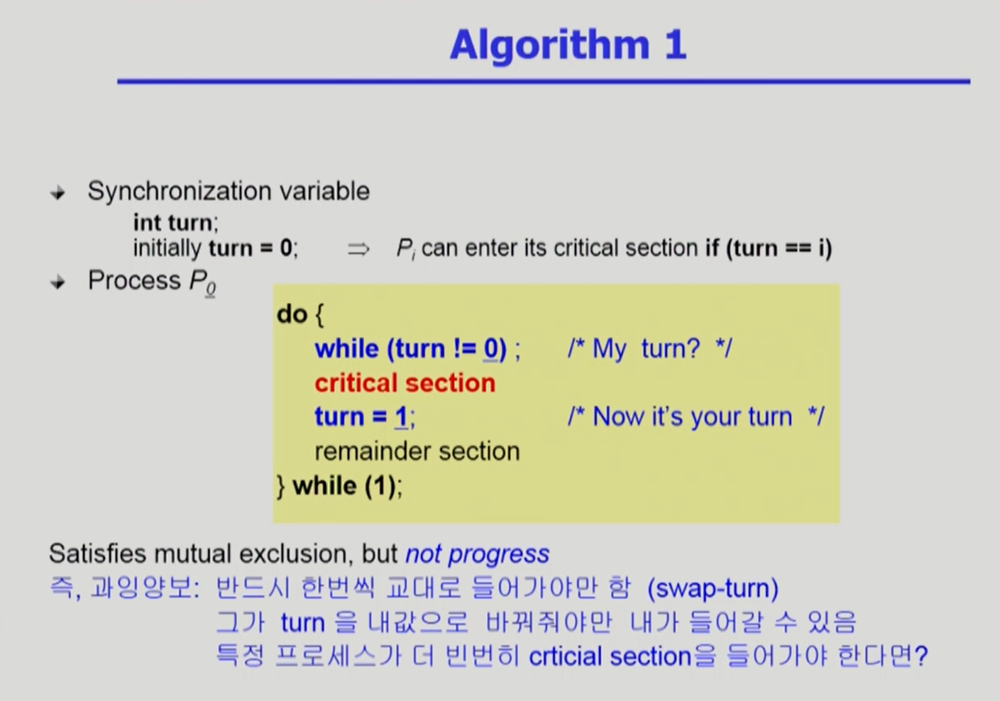
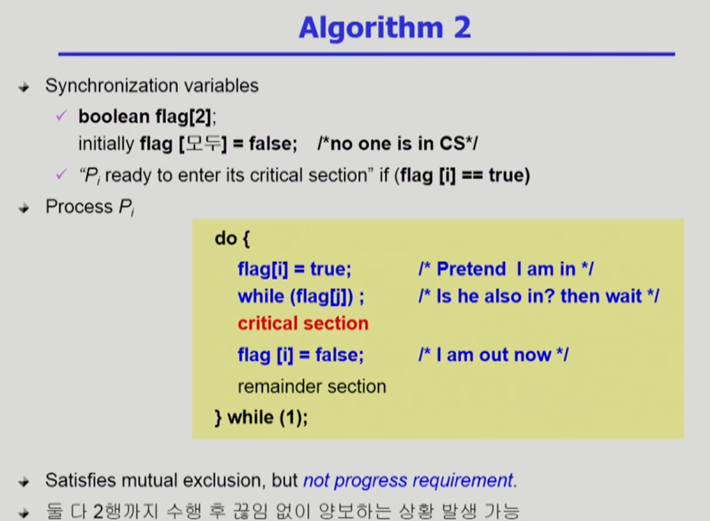
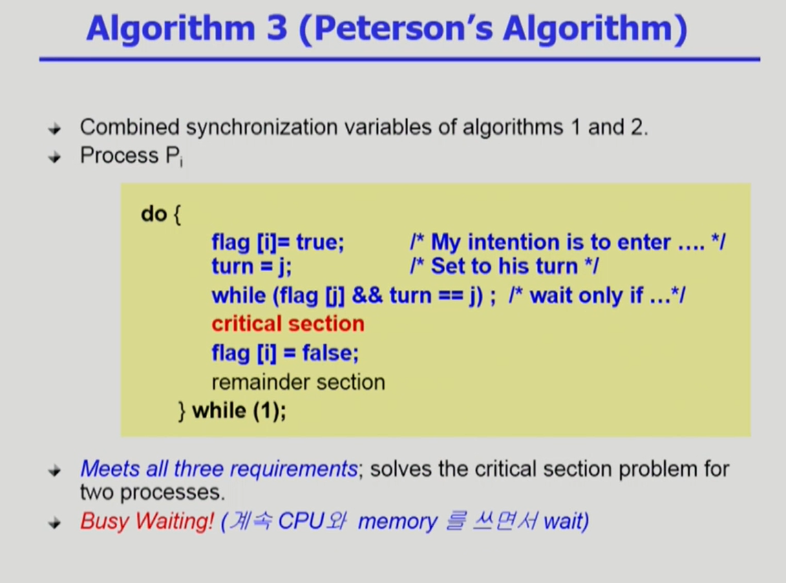
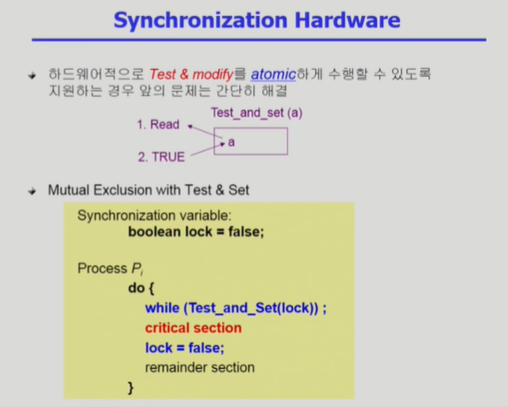

# Process Synchronization 1

## Initial Attempts to Solve Problem

-   공유데이터에 접근하는 코드 : Critical Section
-   코드는 공유데이터에 접근하거나, 안하거나 둘 중 하나다.
-   동시에 접근하면 문제가 생기니, entry section을 넣어 lock을 걸어 동시 접근을 막고, critical section이 끝나면 exit section에서 unlock을 해 다른 사람들의 접근을 허용한다.

## 프로그램적 해결법의 충족 조건

1. `Mutual Exclusion`(상호 배제)
    - 프로세스 Pi가 critical section 부분을 수행 중이면 다른 모든 프로세스들은 그들의 critical section에 들어가면 안된다.
2. `Progress`(진행)
    - 아무도 critical section에 있지 않은 상태에서 critical section에 들어가고자 하는 프로세스가 있으면 critical section에 들어가게 해주어야 한다.
3. `Bounded Waiting`(유한 대기)
    - 프로세스가 critical section에 들어가려고 요청한 후부터 그 요청이 허용될 때까지 다른 프로세스들이 critical section에 들어가는 횟수에 한계가 있어야 한다.
    - 즉, `기다리는 시간이 유한`해야 한다. Starvation이 일어나서는 안된다.
    - 만약 셋이 기다리고 있는데, 둘만 번갈아가며 들어가고, 하나는 못 들어가면 안된다.

-   가정
    -   모든 프로세스의 수행 속도는 0보다 크다
    -   프로세스들 간의 상대적인 수행 속도는 가정하지 않는다.

## 알고리즘 1

-   프로세스가 2개 있다. P0, P1이 있다.
-   위의 사진은 프로세스 P0를 위한 코드다.
-   critical section에 들어가기 전에 while문을 돌며, turn이라는 변수를 확인한다. turn은 P0의 차례인지, P1의 차례인지 나타내는 변수다.
-   `while (turn != 0);`로 `turn이 0이 될 때까지` 기다린다.
-   프로세스 P1이 `turn을 1에서 0으로` 바꾼다. `이제 critical section에 들어간다`.
-   그 후, `다 수행하면 turn을 1로` 바꾸어주고 나머지를 실행한다.
-   이 코드는 `Mutual Exclusion을 만족`한다. 하지만, 아무도 critical section에 없는데, 들어갈 수 없는 `Progress를 만족 못하는 상태`가 생길 수 있다.
    -   이 코드는 critical section에 들어가기 위해 교대로 들어간다고 가정한다. P1이 들어갔다 나와야지만 P0가 실행 가능하다. 만약, `P1이 한번만 실행`된 후 다시 실행되지 않으면, `P0는 본인 차례가 끝난 후 영원히 critical section에 들어가지 못한다`.

## 알고리즘 2

-   이번에는 flag라는 배열을 사용한다. 본인이 `critical section에 들어가고자 하는 의중`을 표시한다.
-   flag값은 처음에는 모두 false다.
-   Pi가 critical section에 들어가고자 하면, `flag[i]를 true로` 바꾼다.
-   `상대방이 flag를 세팅해 놓았는지 체크`한다.
-   `있으면 기다린다.` `없으면 critical section에 들어갔다 나오며 flag[i]=false`로 바꾼다.
-   이제 나머지를 수행한다.
-   `Mutual Exclusion을 만족`하나, `Progress를 만족하지 못한다`.
    -   만약 프로세스 i가 본인 깃발을 든 후(`flag[i] = true`) CPU 점유권을 빼앗긴다. 프로세스 j가 이번에는 본인 깃발을 든다(`flag[j] = true`). 그러면, 둘 중 누구 하나 critical section을 실행하고 있지 않으나, 서로가 flag가 들려 있어 끊임없이 실행되지 않고 양보한다.

## 알고리즘 3(피터슨 알고리즘)

-   피터슨이라는 사람이 만든 알고리즘
-   앞의 1, 2를 합쳤다.
-   프로세스 Pi가 들어가고자 한다. 우선, `깃발을 올리고(flag[i] = true)`, `상대방(j)의 턴으로 바꾸어` 준다.
-   `flag[j]가 올라가 있고, turn이 j이면 대기`하고(즉, j가 사용하고 있거나 사용하려 하면 대기), `아닌 경우(j가 사용 의사가 없거나 내 턴으로 넘어온 경우) critical section을 실행`하고, `flag[i]를 false`로 바꾼다.
-   앞의 3가지 조건을 `모두 만족`한다. `둘이 동시에 들어가지 않고`, `하지만 없으면 들어가고`, `누군가 너무 오래 대기하지 않는다`.
    -   하지만 `Busy Waiting(=spin lock)`이라는 문제가 생긴다. 대기 시 `계속 CPU와 memory를 쓰면서 wait`한다. 본인의 CPU 시간에 계속 while문을 돌지만, `이 while문을 빠져나가려면 상대방이 실행`되어야 하니, `그냥 낭비되는 시간`일 뿐이다.

## Synchronization Hardware

-   보시다시피, 이런 간단한 일에도 복잡한 코드가 요구된다. 이런 문제가 있는 이유는 data를 쓰고 읽는 것을 하나의 instruction으로 실행 불가능했기 때문이다. instruction이 실행되는 중에 interrupt한테 빼앗길 수는 없기 때문이다.
    -   데이터를 읽고 쓰는 작업을 동시에 수행 가능한, 하드웨어적으로 지원되는 instruction이 있고, 이를 쓰면 문제가 해결된다.
-   하지만, `하드웨어적`으로 이를 막아주면 이런 걱정을 할 필요가 없이 간단히 해결된다.
-   대표적으로 `Test_and_set`이라는 instruction을 이용한다. Test_and_set(a)는 a의 값을 읽고, TRUE로 바꿔주는 것을 한번에 수행해주는 instruction이다. `만약 a=0이었다면, 이 instruction을 하면 0이 읽히고 a=1로 바뀐다`. 반대로, `a=1`이었다면, `읽었을 때 1이 읽히고, 다시 a=1로 세팅`된다. 이를 `atomic`하게, `하나의 instruction`으로 처리한다.
    -   이러면 코드가 간단해진다. `critical section의 lock이 1로 되어있는지 확인`해, `1이면 대기`하고, `0이면 1로 바꿔주면서(lock 걸기) 작업을 수행`한다.
    -   그 후, `lock=false`로 바꾸어 `다음 프로세스가 수행`되도록 한다.

# 예고

-   프로그래머가 매번 이런 작업을 하기는 귀찮다. 그래서 `이를 추상화해주는 Semaphores`를 다음 시간에 알아보자.
