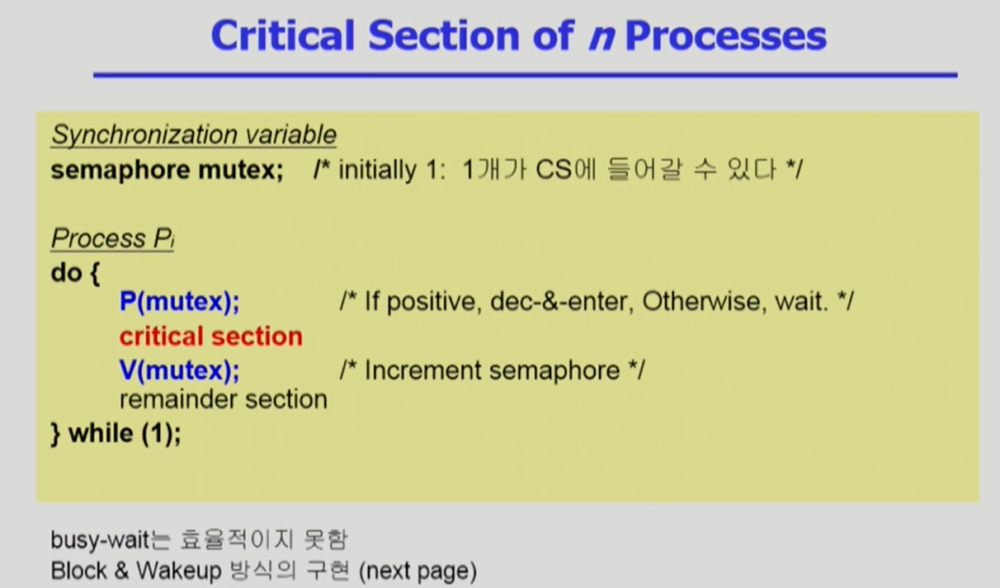
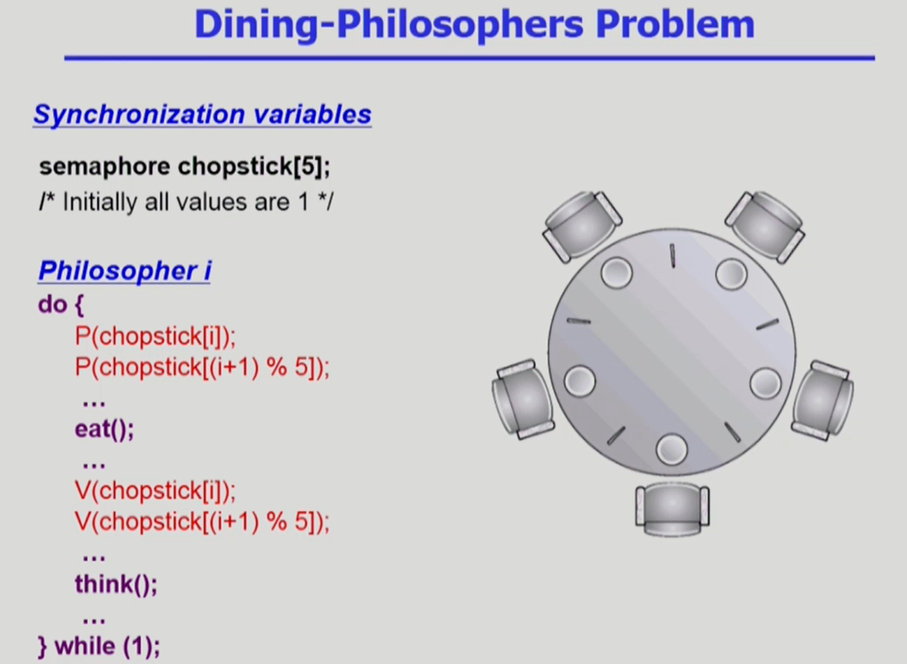

# Process Synchronization 2

## 세마포어(Semaphores)

-   앞의 방식들을 추상화시킴
-   Semaphore 'S'
    -   integer variable
    -   아래의 두 가지 atomic 연산에 의해서만 접근 가능
        -   `P(S)` :
        ```
        while (S<=0) do no-op;
        S--;
        ```
        -   If positive, decrement & enter. Otherwise, wait until positive(`busy-wait`)
    -   `V(S)` : `S++;`
    -   P연산과 V연산
    -   P연산 - 세마포어 연산 변수 획득 과정
    -   V연산 - 다 사용 후 반납하는 과정
    -   S는 획득한 자원의 개수라고 생각하면 됨
        -   S가 5라면 자원을 5개 사용할 수 있고, V연산은 다 사용하고 내어놓는 것이다.
    -   락을 걸고 푸는 과정은 S가 1인 경우라 생각하면 된다. P연산은 락을 걸고, V연산은 락을 푼다.
-   `P연산` : `S가 0 이하인 경우`(다른 사람이 자원을 다 사용 중인 경우), `아무것도 안하고 기다린다`. 만약 `자원이 양수가 되면 자원을 획득하고 S값을 줄인다`(즉, 자원을 사용중임을 표시).
-   `V연산` : `자원을 다 사용하고 내어놓았다는 뜻`으로 S++를 한다.
-   둘 다 atomic한 연산이다. 즉, 이 작업은 atomic하게 이루어져야 한다.
-   busy-wait문제 : 자원이 없을 때, P연산을 하면 그냥 계속 기다리다 본인 시간을 다 쓰고 끝난다.

## Critical Section



-   크리티컬 섹션 문제에 사용할 경우, `mutex에 1을 넣고, 들어갈 때 P, 나갈 때 V 연산` 하면 된다.
-   이 P, V를 어떻게 구현할지를 생각하면 된다.
-   `사용자가 일일이 코딩하는게 아닌, 추상 자료형으로 제공`하고, `프로그래머는 이를 이용해 코딩`하면 프로그래머는 편해진다.
-   `busy-wait`를 하게 한다. 즉, `spin-lock`을 하게 된다. 시간 내내 기다리기만 하다 끝날 수도 있다.
-   `Block & Wakeup`방식으로도 구현 가능하다(`=sleep lock`). `자원을 얻지 못하면 blocked상태로 만들어 CPU 낭비를 하지 못하게 하고, 자원이 나오면 해제`한다. 공유데이터를 얻기 위해 사용하는 경우를 생각해보면 된다.

## Block and Wakeup 구현

```
typedef struct
{
    int value; //semaphore
    struct process *L //process wait queue
} semaphore;
```

-   block : 커널은 block을 호출한 프로세스를 suspend시킴. 이 프로세스의 PCB를 semaphore에 대한 wait queue에 넣음.
-   wakeup(P) : block된 프로세스 P를 wakeup시킴. 이 프로세스의 PCB를 ready queue로 옮김.
    

-   누군가 세마포어 쓰다 반납하면 블록된 애를 하나 깨워서 획득시킴.
-   잠든 프로세스를 연결시켜 깨움.

-   P(S) :
    ```
    S.value--; //preapre to enter
    if(S.value < 0) //cannot enter, because no resource
    {
        add this process to S.L;
        block();
    }
    ```
-   V(S) :
    ```
    S.value++;
    if(S.value <= 0)
    {
        remove a process P from S.L;
        wakeup(P);
    }
    ```
-   이제 프로세스를 블록하고, 깨워주는 과정이 추가된다.
-   P연산에서는 세마포어 값 1 빼주고, 음수면 누군가 다 쓰고 자원 여부가 없는 거니. 이 프로세스는 대기 큐(L)에다 연결시키고 블록한다.
-   V연산에서는 다쓰면 S값을 1 증가시키고, 그럼에도 0이하면(누군가 기다리는 중이라는 의미겠죠?) S.L에서 한 프로세스 깨워서 실행.

## 뭐가 더 좋냐

-   busy-wait vs Block/wakeup
-   `보통은 block/wakeup이 cpu의 낭비를 막으니 좋다`.
-   `critical section의 길이가 길면` block/wakeup 방식이 적절하다.
-   하지만, block/wakeup도 overhead가 들므로, `critical section의 길이가 짧을 경우, busy-wait를 하는게 더 효율적일 수도 있다`.

## 세마포어의 종류

-   `Counting semaphore` : 도메인이 0 이상인 임의의 정수값, 주로 resource counting에 사용
-   `Binary semaphore(=mutex)` : 0 또는 1 값만 가지는 semaphore. 주로 mutual exclusion(lock/unlock)에 사용.

## Deadlock and Starvation

-   세마포어는 잘못하면 문제가 생길 수 있다.
-   S, Q가 1로 초기화된 semaphore라고 하자.
    -   P0, P1프로세스가 각각 S, Q를 차지하고 있다(P(S), P(Q)).
    -   근데, P0는 Q를 추가로 필요로 하고, P1은 S를 추가로 필요로 한다. 그러기 위해서는 기존 프로세스가 이를 놓아야 하는데, 그러려면 현재 내가 가진 프로세스를 놓아야 하고, 그러려면 상대방이 점유한 프로세스가 필요하고(`무한 대기`)
-   이렇게, 상대방이 가진 프로세스를 기다리며 내 걸 놓지 못하면 `deadlock 상황`이 걸린다.
-   해결법 : `자원 획득 순서를 두 프로세스가 똑같이 맞추면 된다.` S -> Q 순서로 얻어야 되도록 둘 다 정의하면, P0가 S를 획득하면, P1은 아무 자원도 획득 못하고 기다리니, 이 문제를 해결 가능하다.

-   Starvation : `Indefinite blocking`. 프로세스가 suspend된 이유에 해당하는 세마포어 큐에서 빠져나갈 수 없는 현상. 위의 상황도 일종의 Starvation으로 볼 수 있다. 즉, deadlock도 일종의 starvation으로 볼 수 있다.

## 식사하는 철학자 문제



-   철학자가 원형 테이블에 앉아 있다. 5명이 있다. 한 철학자가 식사를 하려면 왼쪽이과 오른쪽에 있는 젓가락을 둘 다 얻어야 한다.
-   철학자 A가 있다. 왼쪽의 철학자가 식사를 하는 동안, 식사를 할 수 없다. 왼쪽의 철학자가 식사를 끝냈는데, 오른쪽의 철학자가 식사를 시작하면 먹을 수 없다. 반복되면 철학자 A는 굶는다. 이런 기아상태가 발생 가능하다.
-   데드락도 발생 가능하다. 모든 철학자가 동시에 왼쪽 젓가락을 손에 쥐면, 오른쪽 젓가락을 얻지 못해 모두 동시에 굶는다.
