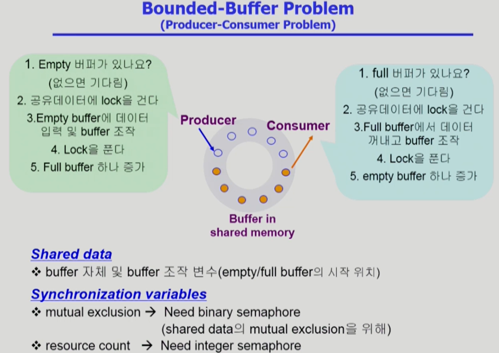
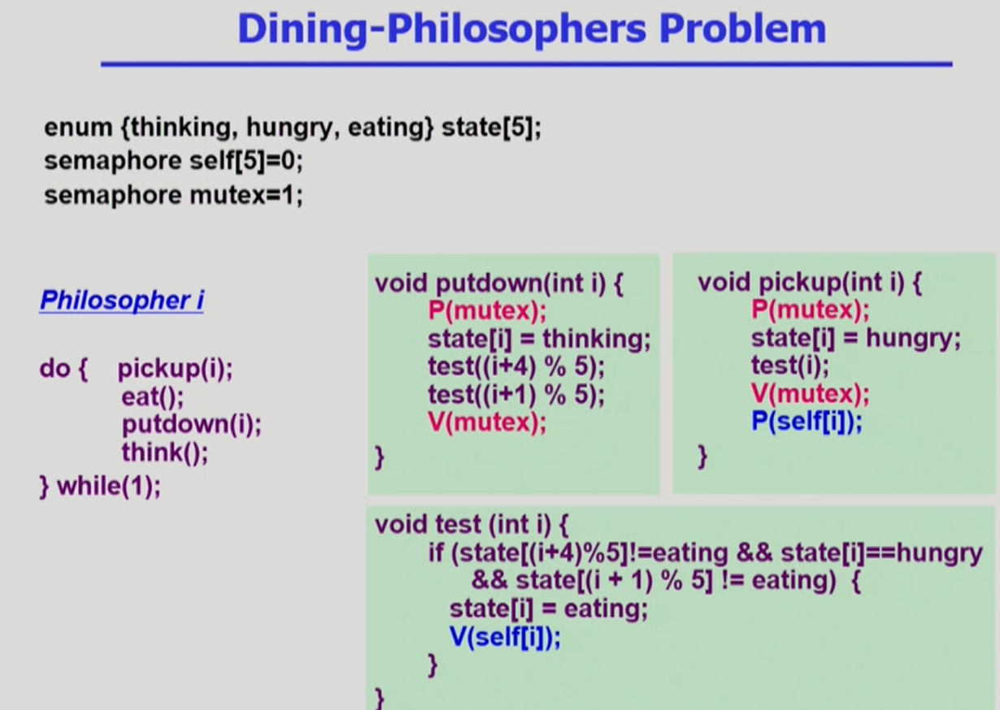
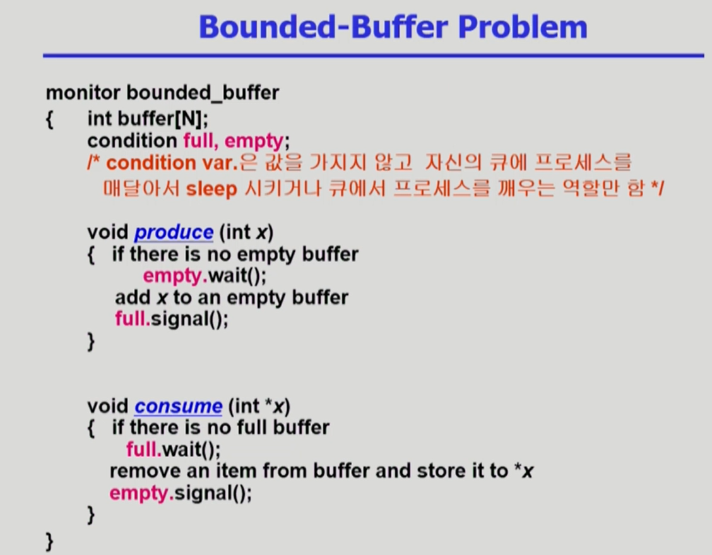

# Process Synchronization 3

## 고전적 synchronization 문제

### Bounded-Buffer Problem(Producer-Consumer Problem)



-   버퍼의 크기는 유한하다.
-   프로세서는 두가지가 있다. Producer, Consumer.
-   Producer가 여러개, Consumer가 여러개 있다.
-   생산자(Producer)는 공유 버퍼에 데이터를 하나 만들어 넣는 역할을 한다. 위의 그림에서 채워진 동그라미다. 소비자(Consumer)는 데이터가 채워진 버퍼의 데이터를 사용해 버퍼를 비운다.
-   여기서는 `다음과 같은 문제가 발생`할 수 있다.
    -   공유 버퍼이므로, `생산자 둘이 동시에 들어와 '같은 빈 버퍼'에 데이터를 만들면` 문제가 생긴다. 그래서 `버퍼에 lock을 걸고 작업을 해야 한다`.
    -   소비자도 마찬가지로 `여럿이서 동시에 데이터를 같은 위치에서 꺼내면 문제가 생긴다`. 이 때도 `버퍼에 lock을 걸고 꺼낸 후 unlock`해야 한다.
    -   즉, 소비자, 생산자는 데이터를 쓰면 unlock하고, 버퍼에 대한 포인터를 다음에 사용할 수 있는데로 옮겨줄 필요가 있다.
    -   `bounded buffer`라 생기는 문제도 있다. 생산자가 `모든 버퍼를 사용중`이라고 가정하자. 소비자가 안 온 상황에서 `생산자가 계속 와서 버퍼를 사용`하려고 한다. 그러면 `사용 가능한 버퍼가 없다`. 빈 버퍼를 사용하려면 `소비자가 와서 버퍼를 하나 사용해 빈 버퍼가 생겨야 한다`.
    -   즉, 생산자 입장에서는 `비어 있는 버퍼`가 `사용 가능한 자원`이다. 생산자는 빈 버퍼가 생길 때까지 기다려야 한다. 이는 소비자가 다 찬 버퍼 중 하나를 사용할 때다.
    -   소비자 입장에서는 `내용이 들어 있는 버퍼`가 `사용 가능한 자원`이다. `자원이 없으면 생산자가 자원을 만들어 줄 때까지 기다려야 한다`.
-   세마포어의 역할은 다음과 같다.
    -   공유 자원에 대해, `접근 중인 버퍼에 lock, unlock`을 걸어야 한다.`(mutual exclusion)`
    -   소비자, 생산자의 `가용 자원(남은 full/empty buffer)이 몇개 있는지 확인`하는 counting semaphore 변수도 필요하다.`(resource count)`
-   즉, 공유 데이터는 `buffer 자체`와 `buffer 조작 변수(empty/full buffer의 시작 위치)`다.

#### pseudo code

-   semaphore full = 0, empty = n, mutex = 1;

-   Producer

```
do {
    ...
    produce an item in x
    ...
    P(empty); //공유 자원 개수 확인. 0이면 기다림.
    P(mutex); //buffer lock
    ...
    add x to buffer
    ...
    V(mutex); //buffer unlock
    V(full); //내용 든 버퍼 수 1 증가.
} while(1);
```

-   Consumer

```
do {
    P(full); //내용이 들어 있는 버퍼 개수 확인. 0이면 기다림.
    P(mutex); //buffer lock
    ...
    remove an item from buffer to y
    ...
    V(mutex); //buffer unlock
    V(empty); //내용 빈 버퍼 수 1 감소
    ...
    consume the item in y
    ...
} while(1);
```

### Readers and Writers Problem

-   프로세스는 두 종류 있다. 읽는 프로세스(Readers), 쓰는 프로세스(Writers)
-   공유 데이터를 DB로 부른다. 보통 DB에서 일어나는 문제이기 때문이다.
-   한 process가 `DB`에 `write 중일 때 다른 process가 접근하면 안된다`. 공유 데이터이기 때문이다. `하지만, read는 동시에 여럿이 해도 된다`.
-   해결법
    -   Writer가 DB에 접근 허가를 아직 얻지 못한 상태에서는 모든 대기중인 Reader들을 다 DB에 접근하게 해준다.
    -   Writer는 대기 중인 Reader가 하나도 없을 때 DB 접근이 허용된다.
    -   일단 Writer가 DB에 접근 중이면, Reader들은 접근이 금지된다.
    -   Writer가 DB에서 빠져나가야만 Reader의 접근이 허용된다.
-   공유 데이터 : DB 자체, readcount(현재 DB 접근 중인 Reader의 수).
-   동기화 데이터 : mutex(공유 변수 readcount에 접근하는 코드의 mutual exclusion 보장), db(reader와 writer가 공유 DB 자체를 올바르게 접근하게 하는 역할)

#### Pseudo code

-   Shared Data : `int readcount=0; DB자체;`
-   Synchronization variables :
    `sempahore mutex = 1, db = 1;`

-   Writer

```
P(db);
...
writing DB is performed
...
V(db);

//starvation 발생 가능
```

-   DB에 lock 걸고 행동한다.
-   위의 코드는 `reader가 다 빠져나갈 때까지 writer가 계속 기다려야 한다`. 만약 reader가 계속 도착하면? `starvation이 발생 가능`하다.

    -   `큐에서 우선순위를 부여해 너무 늦게 온 reader는 잠깐 대기`시키고 현재 읽는 `reader의 읽기 작업이 끝난 후 writer가 일단 접근하도록 할 수 있다`.
    -   위의 코드에는 반영되지 않았다.

-   Reader

```
P(mutex);
readcount++;
if(readcount == 1) P(db); //block writer
V(mutex); //readers follow
...
reading DB is performed
...
P(mutex);
readcount--;
if(readcount == 0) V(db); //enable writer
V(mutex);

```

-   `처음 읽으러 들어왔으면 DB에 lock`건다. 그게 아니면 lock은 걸 필요 없고, `readcount만 증가`한다.
-   `mutex를 이용해 readcount라는 변수에 대해서도 lock을 걸어 여럿이 동시에 건드리지 못하게 해야 한다`.
-   다 읽으면 `빠져나가며 readcount를 빼고`, 내가 마지막으로 빠져 나가면(readcount == 0) DB를 `unlock`한다.

### Dining-Philosophers Problem(식사하는 철학자 문제)


-   철학자 5명이 원탁에 앉아있다.
-   철학자는 생각도 하고 밥도 먹는다.
-   서로가 생각하고 먹는 주기는 다르다. 배고프면 왼쪽, 오른쪽의 젓가락을 잡아 밥을 먹고, 끝나면 내려놓는다.
    -   철학자들은 양쪽의 젓가락을 필요로 한다.
    -   젓가락은 공유 자원이고, 젓가락은 1로 초기화된 세마포어다. 그래서 옆의 사람이 먹고 있으면 먹을 수 없다.
-   이 코드는 위험성이 있다. `Deadlock`의 가능성이 있다. 모든 철학자가 배고파서 왼쪽 젓가락을 잡은 상황이라고 하자. 오른쪽 젓가락을 잡지 못한다. 왼쪽 젓가락을 놓으려면 오른쪽 젓가락을 획득해 먹어야 한다.

#### 해결 방안

-   `4명까지만` 동시에 먹을 수 있도록 한다.
-   `젓가락을 두 개 모두 잡을 수 있을 때만` 젓가락 집도록 한다.
-   `비대칭` : 짝수 철학자는 왼쪽, 홀수 철학자는 오른쪽 젓가락부터 잡도록 한다.



-   `젓가락을 두 개 모두 잡을 수 있을 때만` 잡도록 하는 코드다.
-   사실 위 코드는 세마포어 철학에 약간 안맞으나 뒤에 Monitor 코드가 더 이해하기 쉽다.
-   상태는 먹거나 생각하거나 배고프거나.
-   `semahpore self[5]=0; //젓가락 2개 다 잡을 수 있는 권한이 있는가.`
-   `mutex : 공유 변수(상태)에 대한 동시 접근 막기.`
-   젓가락 잡는 함수 호출 -> 일단 `상태를 hungry`로 바꾸고 `test(i)`를 한다. `내가 배고프고, 왼쪽, 오른쪽이 밥을 안 먹고 있을 때만 V연산을 통해 나에게 직접 밥 먹을 권한을 준다`.
    -   보통 semaphore는 0이상에서 시작해 권한을 카운트 하는데, 이 때는 `test(i)에서 V(self[i])로 잡을 권한을 준 후, P(self[i])를 통해 젓가락 잡는 권한을 얻는다`.
    -   반대로, `test(i)를 통과 못하면 P함수가 있어도, self[i] = 0이니 권한을 얻지 못한다`.
    -   `putdown()을 보면 철학자는 밥을 다 먹고 젓가락을 내려 놓으면 생각하는 상태가 되고, 왼쪽, 오른쪽 철학자에 대한 테스트를 진행해 그 사람이 젓가락을 통해 밥을 먹을 수 있도록 챙긴다`.
-   세마포어 철학에는 잘 안맞으나 monitor방식과는 맞다.

## Monitor

-   Semaphore의 문제점

    -   코딩하기 힘들다
    -   정확성의 입증이 어렵다.
    -   자발적 협력이 필요하다.
    -   한번의 실수가 모든 시스템에 치명적이다.
        -   P연산을 하고 critical section 들어갔다가 나오면서 또 P연산하면? `Deadlock`
        -   V연산을 하고 critical section 들어갔다가 P연산을 하도록 하면? `mutual exclusion 깨짐.`

-   Monitor란?
    -   동시 수행중인 프로세스 사이에서 abstract data type의 안전한 공유를 보장하기 위한 high-level synchronization construct
    ```
    monitor monitor-name
    {
        shared variable declarations
        procedure body P1(...){
            ...
        }
        procedure body P2(...){
            ...
        }
        procedure body P3(...){
            ...
        }
        {
            initialization code
        }
    }
    ```
    -   공유데이터를 아무나 접근할 수 있게 하는게 아니라, `monitor 내부의 procedure를 통해서만 접근 가능`하도록 만든다.
    -   이러면 `lock을 걸 필요가 없다`. 기본적으로 `monitor는 동시 접근을 막고, 나머지 프로세스는 줄 서서 기다리도록 하므로` 프로그래머가 걱정할 필요 없다.
-   모니터 내에서는 한번에 하나의 프로세스만 활동 가능
-   프로그래머가 동기화 제약 조건을 명시적으로 코딩할 필요 없음.
-   프로세스가 모니터 안에서 기다릴 수 있도록 하기 위해 `condition variable` 사용
    -   `condition x, y;`
-   Condition variable은 `wait`와 `signal`연산에 의해서만 접근 가능.
    -   `x.wait();`
        -   x.wait()을 invoke한 프로세스는 다른 프로세스가 x.signal()을 invoke하기 전까지 `suspend`된다.
    -   `x.signal();`
        -   x.signal()은 정확하게 `하나의 suspend된 프로세스를 resume`한다. `Suspend된 프로세스가 없으면 아무 일도 일어나지 않는다`.



-   생산자-소비자 문제의 모니터 버전 코드.
-   생산자, 소비자는 세마포어에서는 락을 걸고 풀었으나, 모니터에서는 락을 걸지 않고, monitor 내부 코드에 정의된 프로시저에 의해 접근하니 문제 없다.
    -   빈 버퍼 없으면 wait, 대기 있으면 signal.
