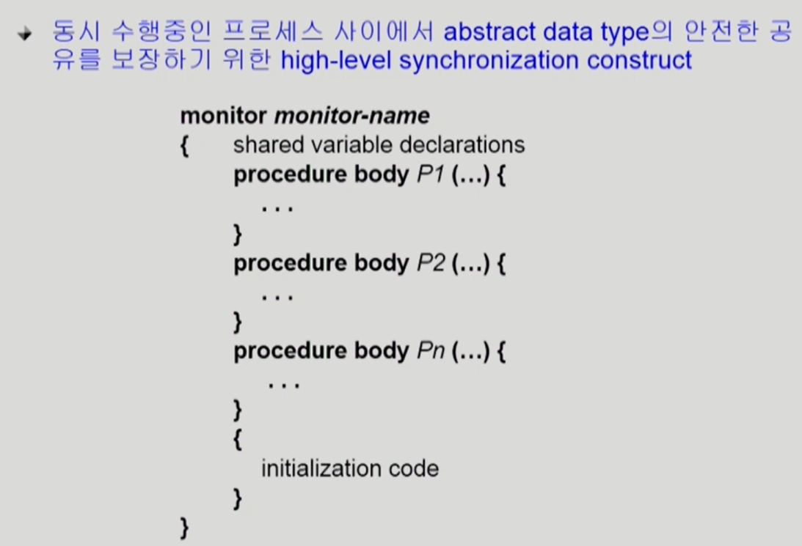

# Process Synchronization 4 (Concurrency Control)

## 지난 시간에 이어

-   Process Synchroniztion(프로세스 동기화)는 다른 말로는 Concurrency Control(병행 제어)라고도 한다.
-   프로세스가 동시에 실행될 때의 문제를 해결할 때 사용하는 방법이다.
-   이를 해결하기 위한 프로그래머의 방법으로 세마포어를 배웠다. 그 후 고전적 프로세스 동기화 문제 3가지를 배웠다.

## 모니터

-   세마포어가 P, V연산을 이용해 프로그래머가 직접 동기화를 시킨다면, Monitor는 프로그래밍 언어 차원에서 동시 접근 관련 공유 데이터 접근 문제를 자동 해결. 공유 데이터 접근 코드를 정의해, 접근을 원하면 해당 코드만 이용하도록 하고, 해당 데이터 접근에 대해 `active한 프로세스는 하나만 있도록 유지`. 프로그래머가 lock걸고 unlock할 필요 없이 monitor가 자동으로 해준다.
-   monitor를 사용하던 `active한 프로세스가 0개가 되거나`, `프로세스가 잠든 상태`가 될 때만 `다음 프로세스가 접근 가능하다`.
    
-   객체 지향적 프로그래밍을 한다면 이런 코드가 나올 것이다.

### 모니터 정리

-   모니터 내에서는 한번에 하나의 프로세스만 활동 가능
-   프로그래머가 동기화 제약 조건을 명시적으로 코딩할 필요없음
-   프로세스가 모니터 안에서 기다릴 수 있도록 하기 위해 `condition variable`사용
    -   `condition x, y;`
    -   아까 프로세스가 잠들어도 다음 차례로 넘어간다고 했는데, 프로세스를 잠들게 할 수 있는 변수를 condition variable로 한다.
-   Condition variable은 `wait`와 `signal` 연산에 의해서만 접근 가능
    -   어떤 조건을 만족하지 않은 프로세스를 suspend하기 위해 존재.
-   `x.wait();`
    -   x.wait()을 invoke한 프로세스는 다른 프로세스가 x.signal()을 invoke하기 전까지 `suspend`된다.
    -   이 함수를 쓰면 해당 프로세스는 `x라는 대기열에 줄을 서고` 잠을 자게 된다.
-   `x.signal();`
    -   x.signal()은 정확하게 하나의 `suspend`된 프로세스를 resume한다. Suspend된 프로세스가 없으면 아무 일도 일어나지 않는다.
    -   이 함수를 쓰는건 `누군가가 x라는 변수를 다 쓰고 나가`는 상황이다. 이 때, `x 대기열에 줄 서 있던 프로세스 하나가 깬다`.
    -   잠든게 없으면 아무 일도 안 일어난다.

### 생산자-소비자 문제 모니터 코드

-   process가 2가지다. 공유버퍼에 자원을 넣는 코드, 빼서 쓰는 코드.
-   생산자는 buffer전체에 락 걸고 작업, 소비자도 마찬가지.
-   이 코드에서는 monitor가 다 해주니 프로그래머가 락을 걸고 뺄 필요 없다.
-   Condition variable: `full`, `empty`
-   `full은 내용이 다 찬 버퍼를 기다리며` 줄 선다.
-   `empty는 내용이 텅 빈 버퍼를 기다리며` 줄선다.
-   `produce`는 빈 버퍼가 없으면 `데이터를 넣지 못하니 empty에 줄 세우고`, 내용을 채우면 `내용이 든 버퍼가 생겼으니 full에 줄 서 있던 것을 깨운다`.
-   `consume`은 반대다.
-   사실 모니터, 세마포어는 서로 전환 가능하다.
    -   세마포어에서는 `락을 거는 코드가 있고`, `모니터에는 없다`.
    -   세마포어에서는 `비거나 찬 버퍼 세는 부분이 있고`, 모니터는 `체크 후 없으면 줄 세우는 condition variable`이 있다.

### 식사하는 철학자 문제 Monitor 코드

-   각각의 철학자들은 젓가락을 잡거나 놓아야 하고, 이 함수는 monitor 내부의 코드로 구현되어 있다.
-   철학자의 상태는 인접한 철학자도 바꿀 수 있으니, state배열은 공유 변수
-   `test는 왼쪽, 오른쪽 철학자가 밥을 먹지 않는지 확인 + 본인이 배고픈지도`
-   잠들어 있으면 깨워야 하는데(`self[i].signal()`), 사실 pickup함수가 실행되며 test가 체크되는 구조이므로, 잠들어 있을리 없으니 무시 가능.
-   양쪽 철학자가 모두 잡고 있으면 `self[i].wait()`
-   다 먹으면 `putdown()`, 상태 업데이트 후, 왼쪽, 오른쪽 철학자가 혹시 나 때문에 자고 있는게 아니었는지 체크.
