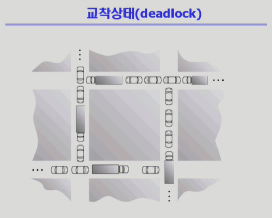
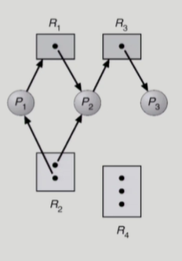
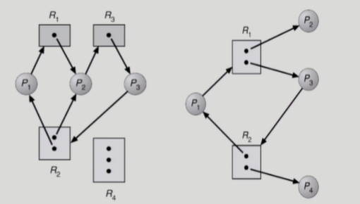
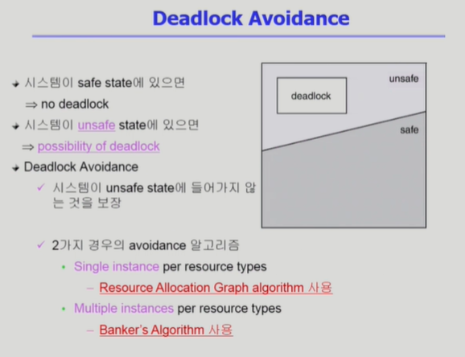
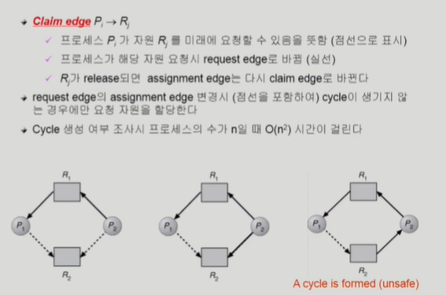
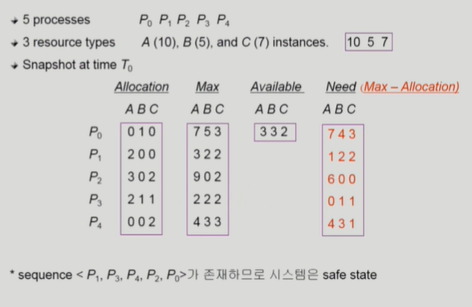
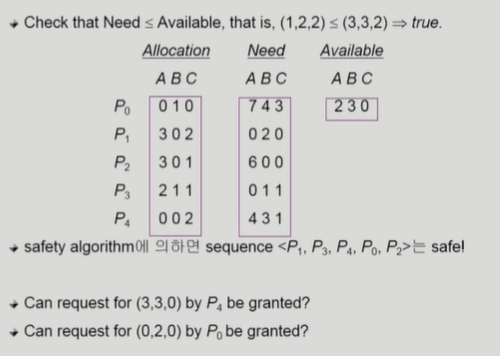

# Deadlock 1

## 데드락

-   우리말로 교착상태 
    
-   사거리에서 차들이 서로를 막고 있어서 진행이 불가능하다.
-   컴퓨터 프로세스가 `가진 자원을 놓지 않으면서 서로의 자원을 요구`하면 이런 문제가 생긴다.

### 정의

-   일련의 프로세스들이 서로 가진 자원을 기다리며 block된 상태

#### 자원이란?

-   Resource(자원)
-   하드웨어, 소프트웨어를 포함하는 개념
    -   예) I/O device, CPU cycle, memory space, semaphore 등
-   프로세스가 자원을 사용하는 절차
    -   Request, Allocate, Use, Release
    -   자원 요청, 자원 획득, 자원 사용, 자용 반납
-   Example 1
    -   시스템에 2개의 tape drive가 있다.
    -   process P1, P2 각각이 하나의 tape drive를 보유한 채 다른 하나를 기다리고 있다.
-   Example 2
    -   Binary semaphores A and B
    -   P0 -> `P(A); P(B);`
    -   P1 -> `P(B); P(A);`

## Deadlock 발생의 4가지 조건

-   `Mutual exclusion`(상호배제)
    -   매 순간 하나의 프로세스만이 자원을 사용할 수 있음
-   `No preemption`(비선점)
    -   프로세스는 자원을 스스로 내어 놓을 뿐 강제로 빼앗기지 않음
-   `Hold and wait`(보유대기)
    -   자원을 가진 프로세스가 다른 자원을 기다릴 때 보유 자원을 놓지 않고 계속 가지고 있음
-   `Circular wait`(순환대기)
    -   자원을 기다리는 프로세스 간에 사이클이 형성되어야 함
    -   프로세스 P0, P1, P2, ... , Pn이 있을 때
        -   P0는 P1이 가진 자원을 기다림
        -   P1는 P2이 가진 자원을 기다림
        -   Pn-1는 Pn이 가진 자원을 기다림
        -   Pn는 P0이 가진 자원을 기다림
-   이 4가지를 `모두 충족해야` 데드락이 발생한다.

## 자원할당그래프(Resource-Allocation Graph)

-   Vertex
    -   Process P = {P1, P2, ... , Pn}
    -   Resource R = {R1, R2, ... , Rm}
-   Edge

    -   request edge Pi -> Rj
    -   assignment edge Rj -> Pi

-   그림을 보면 `동그라미가 프로세스`, `자원은 네모`
-   `자원 -> 프로세스 화살표`와 `프로세스 -> 자원 화살표`가 있다.
-   `프로세스 -> 자원은 요청`상태
-   `자원 -> 프로세스는 할당`상태
-   자원 속 점들은 `인스턴스`다. 이 인스턴스를 각각의 프로세스에 할당 가능하다.

-   그래프에 cycle이 없으면 `deadlock이 아니다`.
-   그래프에 cycle이 있으면

    -   if `only one instance per resource type`, then `deadlock`
    -   if `several instances per resource type`, `possibility of deadlock`

-   우선 저 그림보다 위의 첫 자원할당 그래프는 `cycle이 없으니 deadlock이 없다`.
-   위의 그림의 첫, 두번째 그래프는 cycle이 있다.

    -   왼쪽 그림은 R2의 자원이 2개다. 하지만, 사이클이 2개가 만들어져 있고, 따져보면 자원이 2개여도 `deadlock이 있다`.
    -   오른쪽 그림은 사이클이 있으나, 자원이 2개씩 있고, P1은 P2가 끝나면 자원을 얻고 끝낼 수 있고, P3는 P4가 끝나면 마찬가지로 가능하다. 고로, `deadlock이 없다`.

-   이렇게 자원할당 그래프로 deadlock의 체크가 가능하다. 나중에 테이블 방법도 배운다.

## Deadlock의 처리방법

-   위로갈수록 강한 방법
-   Deadlock을 미연에 방지
    -   `Deadlock Prevention`
        -   자원 할당 시 Deadlock의 4가지 필요 조건 중 어느 하나가 만족되지 않도록 하는 것
    -   `Deadlock Avoidance`
        -   자원 요청에 대한 부가적인 정보를 이용해서 deadlock의 가능성이 없는 경우에만 자원을 할당
        -   시스템 state가 원래 state로 돌아올 수 있는 경우에만 자원 할당
-   Deadlock이 생겨도 놔두는 방법

    -   `Deadlock Detection and recovery`
        -   Deadlock 발생은 허용하되 그에 대한 detection 루틴을 두어 deadlock 발견 시 recover
    -   `Deadlock ignorance`
        -   Deadlock을 시스템이 책임지지 않음
        -   UNIX를 포함한 대부분의 OS가 책임

-   현대의 운영체제는 대부분 `Deadlock ignorance를 채택`하고 `사람이 알아서` 프로세스를 죽이든지 해서 해결한다.
-   Deadlock이 `자주 발생하는 것이 아니므로`, deadlock처리에 `많은 오버헤드를 사용하기 보다는 그냥 놔둔다`.

### Deadlock Prevention

-   `Mutual Exclusion`
    -   공유해서는 안되는 자원의 경우, 반드시 성립해야 함.
    -   막을 수 없는 것.
-   `Hold and Wait`
    -   프로세스가 자원을 요청할 때 다른 어떤 자원도 가지고 있지 않아야 함.
    -   방법1 ) 프로세스 시작 시 모든 필요한 자원을 할당받게 하는 방법
    -   방법2 ) 자원이 필요한 경우, 보유 자원을 모두 놓고 다시 요청
-   `No preemption`
    -   process가 어떤 자원을 기다려야 하는 경우, 이미 보유한 자원이 선점됨
    -   모든 필요한 자원을 얻을 수 있을 때 그 프로세스는 다시 시작된다.
    -   State를 쉽게 save하고 restore할 수 있는 자원에서 주로 사용(CPU, memory)
-   `Circular Wait`
    -   모든 자원 유형에 할당 순서를 정하여 정해진 순서대로만 자원 할당
    -   예를 들어 순서가 3인 자원 Ri를 보유 중인 프로세스가 순서가 1인 자원 Rj를 할당받기 위해서는 우선 Ri를 release해야 한다.
    -   누구는 1번을 가지고 3번을 기다리고, 누구는 3번을 가지고 1번을 기다려 생긴 문제인데, 순서가 있으면 cycle도 발생하지 않는다.

이러한 방법들의 문제 -> Utilization 저하, throughput 감소, starvation 문제

### Deadlock Avoidance

-   미연에 deadlock을 방지하는 방법
-   자원 요청에 대한 부가정보를 이용해서 자원 할당이 deadlock으로부터 안전(safe)한지를 동적으로 조사해서 안전한 경우에만 할당
-   가장 단순하고 일반적인 모델은 프로세스들이 필요로 하는 각 자원별 최대 사용량을 미리 선언하도록 하는 방법임
    -   즉, 프로세스가 평생 쓸 자원의 양을 알고 하는 것.

#### safe state

-   시스템 내의 프로세스들에 대한 `safe sequence`가 존재하는 상태

#### safe sequence

-   프로세스의 sequence < P1, P2, ... , Pn > 이 safe하려면 Pi(1 <= i <= n)의 자원 요청이 `"가용 자원 + 모든 Pj(j < i)의 보유 자원"`에 의해 충족되어야 함.
-   조건을 만족하면 다음 방법으로 모든 프로세스의 수행을 보장
    -   Pi의 자원 요청이 즉시 충족될 수 없으면 모든 Pj(j < i)가 종료될 때까지 기다린다.
    -   Pi-1이 종료되면 Pi의 자원요청을 만족시켜 수행한다.

#### 다시 본제로,

-   시스템이 safe state에 있으면 -> no deadlock
-   시스템이 `unsafe state`에 있으면 -> `possibility of deadlock`
-   Deadlock Avoidance
    -   시스템이 `unsafe state에 들어가지 않는 것을 보장`.
    -   두가지 avoidance 알고리즘
        -   `Single instance` per resource types
            -   `Resource Allocation Graph algorithm` 사용
        -   `Multiple instances` per resource types
            -   `Banker's Algorithm` 사용

### Resource Allocation Graph algorithm

-   `Claim edge` Pi -> Rj
    -   프로세스 Pi가 자원 Rj를 `미래에 요청할 수 있음`을 뜻함(점선으로 표시)
    -   프로세스가 해당 자원 `요청 시, request edge로 바뀜`(실선)
    -   Rj가 `release`되면 `assignment edge는 다시 claim edge`로 바뀐다.
-   `request edge의 assignment edge 변경 시(점선을 포함하여) cycle이 생기지 않는 경우에만 요청 자원을 할당`한다.
    -   혹여나 deadlock이 안 걸리더래도, 최악의 상황을 항상 가정해서 하는 방식
-   Cycle 생성 여부 조사 시 `프로세스 수가 n`일 때, `O(n^2)`의 시간이 걸린다.

### Banker's Algorithm

-   가정
    -   모든 프로세스는 자원의 최대 사용량을 미리 명시
    -   프로세스가 요청 자원을 모두 할당받은 경우, 유한 시간 안에 이들 자원을 다시 반납한다.
-   방법
    -   기본 개념 : 자원 요청 시 safe 상태를 유지할 경우에만 할당
    -   총 요청 자원 수가 가용 자원의 수보다 적은 프로세스를 선택(그런 프로세스가 없으면 unsafe 상태)
    -   그런 프로세스가 있으면 그 프로세스에게 자원 할당
    -   할당받은 프로세스가 종료되면, 모든 자원을 반납
    -   모든 프로세스가 종료될 때가지 이러한 과정 반복

-   5개 프로세스, 3가지 자원
-   Allocation은 현재 할당 자원
-   Max는 평생 사용 가능성
-   Available은 남은 가용자원
-   Need는 추가 요청 가능 양
-   예를 들어, P1이 자원을 A 1개, C 2개 요청했다. 
    
-   Available과 비교하면 당장 줄 수는 있다.
-   하지만, Process 1의 Need를 보자.
    -   최대로 요청해도 `가용 자원에서 추가로 줄 수 있다`.
-   만약 P0이 B 2개를 요청할 경우?
    -   당장은 줄 수 있지만, P0가 `Need만큼 요청`하면 충족 안되므로 `안됨`.
