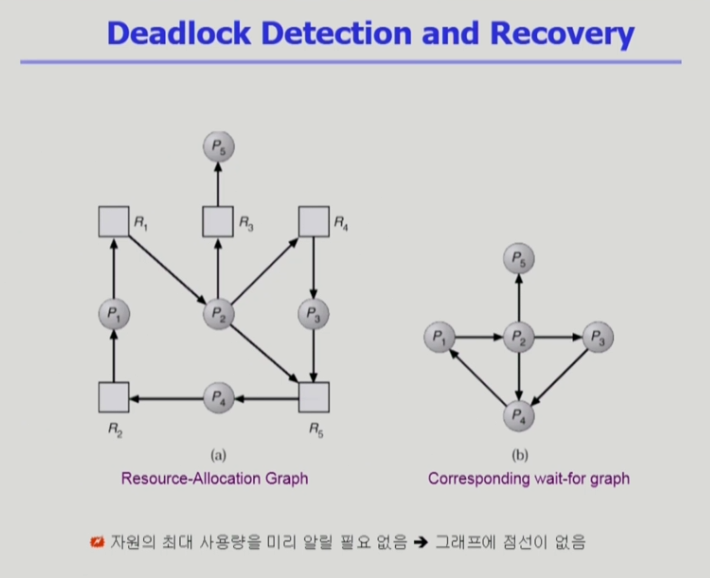
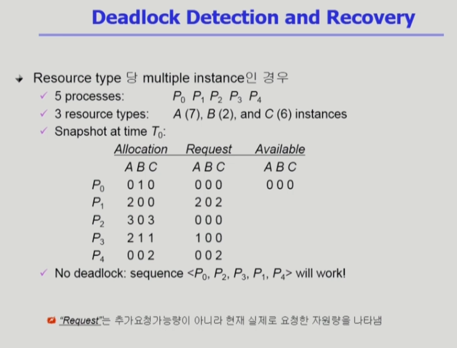

# Deadlock2

## 지난 시간 요약
- 지난 시간에 Deadlock의 처리 방법 4가지 종류를 배웠다.
- Deadlock Prevention, Deadlock Avoidance에 대해서 배웠다.
- Deadlock Avoidance를 위해 사용하는 Banker's Algorithm은 최악의 상황을 가정하며 deadlock을 피하는 방법.
    - 만약 어떤 프로세스가 자원을 요청할 때, 현재 요청 개수와 상관 없이 각 프로세스의 최대 요청 자원을 현재 가용 자원으로 감당 가능해, 가용 자원을 통해 프로세스가 끝날 수 있을 때만 자원을 할당한다.
    - 이렇게 하면, 프로세스는 무조건 끝날 수 있고, 끝나고 자원을 뱉어내면 이 자원을 추가로 활용해 새로운 프로세스에 자원을 할당하는 등의 방식으로 deadlock 없는 safe state를 유지 가능하다.
    - 매우 비효율적이다. 가용 자원이 있어도 항상 최악의 상황을 생각하기 때문이다. 그리고, Deadlock은 거의 안 걸린다.

## 오늘의 내용
- 지금까지의 내용은 Deadlock을 발생시키지 않는 방법이었다.
- 이번에 배울 내용은 Deadlock이 발생할 수 있고, 발생하면 문제를 해결하는 방법이다.

## Deadlock Detection and Recovery

### Deadlock Detection
- Resource type 당 single instance인 경우
    - 자원할당 그래프에서의 cycle이 곧 deadlock을 의미
- Resource type 당 multiple instance인 경우
    - Banker's algorithm과 유사한 방법 활용

 
 

- Wait-for graph 알고리즘
    - Resource type 당 single instance인 경우
    - Wait-for graph
        - 자원할당 그래프의 변형
        - 프로세스만으로 node 구성
        - Pj가 가지고 있는 자원을 Pk가 기다리는 경우 (Pk -> Pj)
    - Algorithm
        - Wait-for graph에 사이클이 존재하는지를 주기적으로 조사
        - `O(n^2)`
    - 그래프를 이용하는건 사실 multiple할 때 사용하는 table과 banker's algorithm의 subset. 자원당 instance가 몇 개이건 banker's algorithm과 유사한 것을 쓰는 게 더 좋다.
- 자원할당 그래프에서 자원 부분을 빼고 wait-for graph로 만든다. 그 후, 그래프에서 cycle이 있는지를 확인하면 deadlock의 탐지가 가능하다.
    - 해당 cycle을 찾는 overhead가 O(n^2)이다. 프로세스 n개의 cycle을 알기 위해서는 화살표를 모두 따라가야 한다. 화살표는 n개의 프로세스에 각각 (n-1)개 있을 수 있다. 따라서 O(n^2)이 나온다.
    - 더 궁금하면 자료구조 관련해 DFS, BFS에 관한 내용을 학습해보자. 이 알고리즘을 약간 응용한게 cycle 탐색이라 그렇다.
- 자원당 instance가 여러개면 table을 사용한다.
    - 현재 할당된 자원의 양, 요청량, 가용 자원 양을 확인한다. 앞의 banker's algorithm과 달리 `최대 요청 가능한 양은 필요 없다`.
    - 위 그림에서는 1번 프로세스가 A 2, C 2을 요청했는데 가용 자원이 없는 상황이다. 또, 3번 프로세스가 A 1개를 요청했는데 가용 자원이 없다. 4번 프로세스에도 이어진다...
    - 이번에는 보수적이 아닌 정말 deadlock인지 확인하는 낙관적 상황을 기준으로 본다.
    - 현재 요청이 없는 프로세스로부터 자원이 반납될 것이라는 가정을 한다. 반납 이후 처리 가능한 요청이 있는지 확인한다. 해당 작업이 처리되고 추가 자원 반납이 있으면 실행 가능한 요청이 있는지 확인하는 것을 반복한다.
    - 이런 sequence가 있으면 deadlock이 없다.
    - 만약, 여기서 P2가 자원 C를 추가 요청하면 어떻게 될까? 이제 P0만 유일하게 요청이 없다. P0가 사용하던 B를 1개 반납해봤자 나머지 프로세스에서 B를 요청한게 없다. `어느 누구의 요청도 받아들일 수 없으니 Deadlock이 발생했다`!!!

### Deadlock Recovery
- `Process termination`
    - Abort `all` deadlocked processes
    - Abort `one process at a time` until the deadlock cycle is eliminated
    - 간단히 말하면 process를 종료시키는 방법

- `Resource Preemption`
    - 비용을 최소화할 victim의 선정
    - safe state로 rollback하여 process를 restart
    - Starvation 문제
        - 동일한 프로세스가 계속해서 victim으로 선정되는 경우
        - cost factor에 rollback 횟수도 같이 고려
    - 간단히 말하면 process로부터 자원을 뺏는 방법
    - 자원 뺐었더니 뺐은 프로세스가 또 요청하는 문제가 있을 수 있으니 이를 막아야 한다.

## Deadlock Ignorance
- Deadlock이 일어나지 않는다고 생각하고 아무런 조치도 취하지 않음
    - Deadlock이 매우 드물게 발생하므로 deadlock에 대한 조치 자체가 더 큰 overhead일 수 있음
    - 만약, 시스템에 deadlock이 발생한 경우 시스템이 비정상적으로 작동하는 것을 `사람이 느낀 후 직접 process를 죽이는 등의 방법`으로 대처
    - UNIX, Windows 등 대부분의 범용 OS가 채택
    - 즉, `사용자가 직접 알아서 하는 방법`