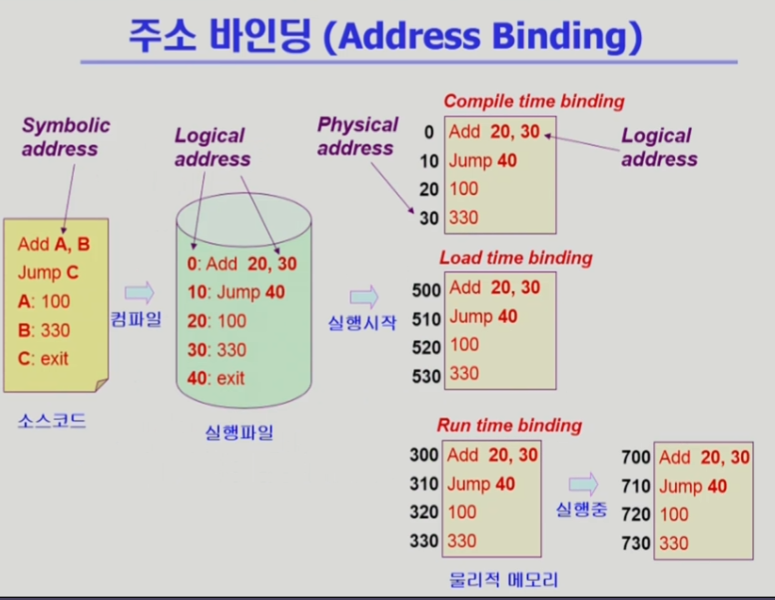
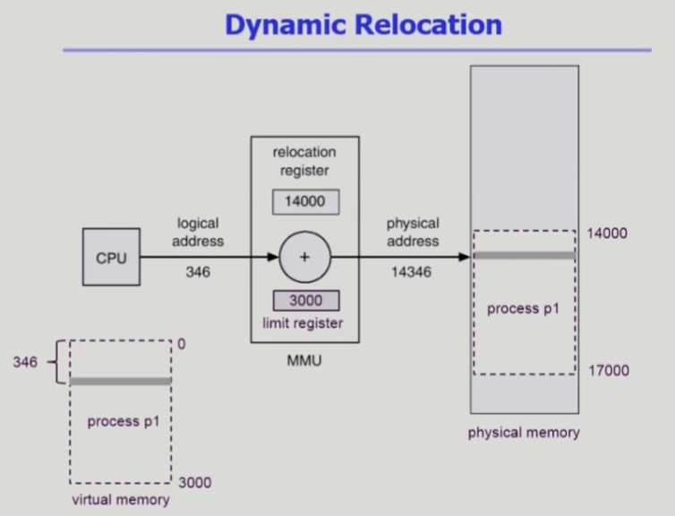
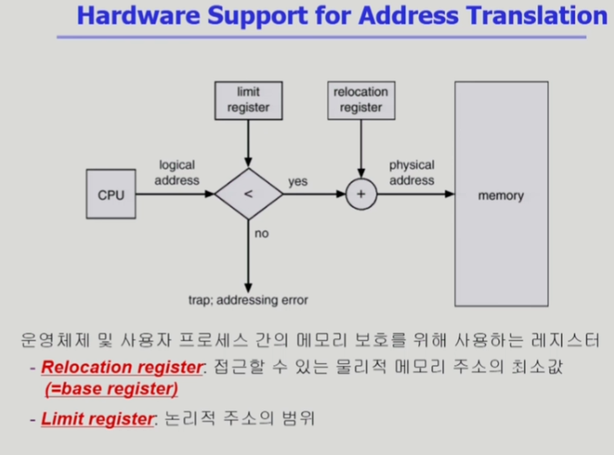
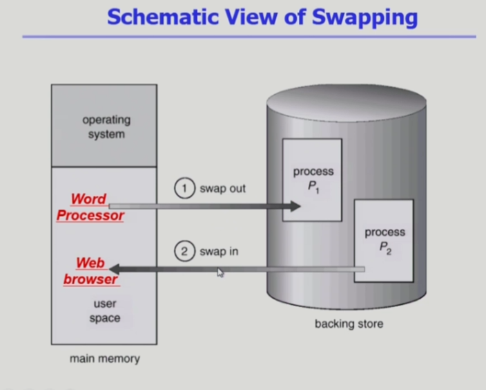
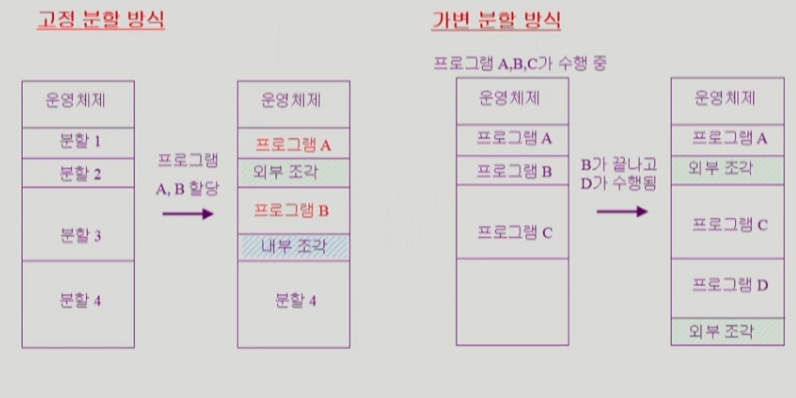
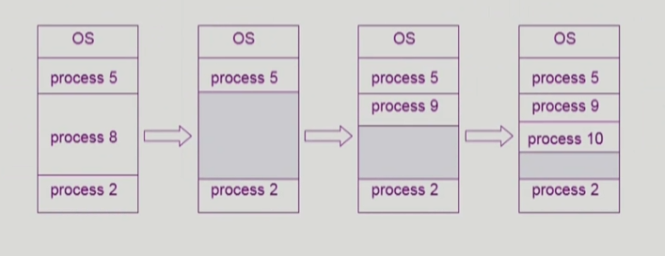

# Memory Management 01

## Logical vs Physical Address
- `Logical address(=virtual address)`
    - 프로세스마다 독립적으로 가지는 주소 공간
    - 각 프로세스마다 0번지부터 시작
    - CPU가 보는 주소는 logical address임
    - 앞에서 공부한 주소 공간

- `Physical address`
    - 메모리가 실제 올라가는 위치

- `Symbolic Address`
    - 프로그래머가 프로그래밍을 할 때 숫자로 주소를 지정하지는 않는다.
    - 몇번 위치에 저장해라가 아닌 무슨무슨 변수에 저장해라, 함수 호출 시 어디로 점프해라가 아닌 어떤 이름의 함수를 호출해라 라고 한다.
    - 이런걸 Symbolic Address(Symbol로 된 Address)라고 한다.

- 주소 바인딩 : 주소를 결정하는 것
    - Symbolic Address -> Logical Address -> Physical address
    - 논리적 주소에서 물리적 주소로, 즉, `프로세스가 메모리 어디로 올라갈지를 결정하는 시점, 주소 변환이 일어나는 시점`이 언제인가?

## 주소 바인딩(Address Binding)

- `Compile time binding`
    - 물리적 메모리 주소(physical address)가 컴파일 시 알려짐
    - 시작 위치 변경시 재컴파일
    - 컴파일러는 절대 코드(`absolute code`) 생성
    - 즉, 컴파일 시 바인딩
    - 이걸 사용하면 `Symbolic -> Logical 시점(컴파일 시점)`에 주소가 논리적 주소가 실제 주소로 바뀐다. 이러면 항상 `특정 위치에만 물리적으로 프로세스를 올려야 하므로` 매우 `비효율적`. 과거에 프로그램을 하나씩만 실행하던 시절 사용.

- `Load time binding`
    - Loader의 책임하에 물리적 메모리 주소 부여
    - 컴파일러가 재배치가능코드(`relocatable code`)를 생성한 경우 가능
    - 즉, 처음 실행 시 바인딩
    - 메모리 로딩 시 비어있는 지점을 보고 physical address를 정한다. 논리적 주소에 빈 공간의 시작 위치에 해당하는 주소 더해서 변환하면 되겠죠?(아래도 마찬가지)

- `Execution time binding(=Run time binding)`
    - 수행이 시작된 이후에도 프로세스의 메모리 상 위치를 옮길 수 있음
    - CPU가 주소를 참조할 때마다 binding을 점검(address mapping table)
    - `하드웨어적인 지원이 필요`(e.g., base and limit registers, MMU).
    - 즉, 프로그램 실행 중에도 변경 가능
    - 프로그램 실행 되다가 내려가고 다시 올라갈 때 비어있는 곳에 들어가는 등의 작업 가능. `현대의 컴퓨터 시스템에서 채택`.

- CPU가 바라보는 주소는? 하드웨어라 Physical address인 줄 알지만 사실은 `Logical Address를 본다`.
    - 그림의 실행 파일 부분을 보면 실행 파일은 logical address로 되어 있다. `컴파일 된 코드의 주소(logical address)`를 바꾸려면 다시 컴파일을 해야 하기 때문이다.
    - CPU가 `주소 요청 시마다` logical address -> physical address가 일어나야 한다.

## Memory-Management Unit(MMU)

- `MMU(Memory-Management Unit)`
    - `logical address`를 `physical address`로 매핑해 주는 `Hardware device`

- MMU scheme
    - 사용자 프로세스가 CPU에서 수행되며 생성해내는 모든 주소값에 대해 `base register(=relocation register)`의 값을 더한다.
    - 위 그림을 보자. logical address 346을 요청하면 `relocation register`과 `limit address` 두 개의 register를 이용해 주소를 변환한다.
    - `base register(시작 위치) + logical address로 주소 결정`, `limit register(프로그램의 크기 저장)을 통해 프로그램이 본인 영역 밖의 무언가를 요청하는 경우 방지`. 예를 들어, 3000 크기의 악의적인 프로그램에서 4000번지를 요청하면 남의 프로그램의 정보가 보일 수 있다. limit address를 통해 이를 방지할 수 있다. 검증 후 문제가 있으면 trap을 걸어서 방지한다.

- user program
    - `logical address`만을 다룬다.
    - 실제 `physical address`를 볼 수 없으며 알 필요가 없다.

## Some Terminologies
- `Dynamic Loading`
- `Dynamic Linking`
- `Overlays`
- `Swapping`

### Dynamic(동적) Loading
- 프로세스 전체를 메모리에 미리 다 올리는 것이 아니라 해당 루틴이 불려질 때 메모리에 load하는 것
- memory utilization의 향상
- 가끔씩 사용되는 많은 양의 코드의 경우 유용
    - 예 : 오류 처리 루틴
- 운영체제의 특별한 지원 없이 프로그램 자체에서 구현 가능(OS는 라이브러리를 통해 지원 가능)
- 주의 사항: 현대의 컴퓨터 시스템에서도 프로그램을 실행시키면 당장 필요한 부분만 메모리로 올라가고, 필요 없으면 쫓겨난다. 이는 `운영체제의 paging system`에 의해 일어나는 것으로, `원래의 dynamic loading과는 다르다`. dynamic loading은 `프로그래머가 수작업`으로 직접 하는 방식이다. 운영체제가 라이브러리를 제공해 지원해주고, 프로그래머가 이를 이용해 직접 구현하는 형태다. 다만, `현재는 운영체제가 알아서 해주는 것의 의미로도 섞어 쓴다`.

- Loading : 메모리로 올리는 것

### Overlays
- 메모리에 프로세스의 부분 중 실제 필요한 정보만을 올림
- 프로세스의 크기가 메모리보다 클 때 유용
- 운영체제의 크기가 메모리보다 클 때 유용
- 작은 공간의 메모리를 사용하던 초창기 시스템에서 수작업으로 프로그래머가 구현
    - `Manual Overlay`
    - 프로그래밍이 매우 복잡
- 내용을 보면 위의 `dynamic loading과 거의 동일`하다. 다만, 역사적으로 보면 다르다. overlays는 초창기 메모리가 매우 작던 시절 프로그램을 한번에 다 올리기 어려워 수작업으로 쪼개서 올리던 것을 의미하고, `운영체제의 지원이 없다`. Dynamic loading은 os가 라이브러리로 지원해 훨씬 쉽게 가능하다.

### Swapping

- `Swapping`
    - 프로세스를 일시적으로 메모리에서 `backing store`로 쫓아내는 것
- `Backing store(=swap area)`
    - 디스크
        - 많은 사용자의 프로세스 이미지를 담을 만큼 충분히 빠르고 큰 저장 공간
- `Swap in / Swap out`
    - 일반적으로 중기 스케줄러(swapper)에 의해 swap out 시킬 프로세스 선정
    - priority-based CPU scheduling algorithm
        - priority가 낮은 프로세스를 swapped out 시킴
        - priority가 높은 프로세스를 메모리에 올려 놓음
    - Compile time 혹은 load time binding에서는 원래 메모리 위치로 swap in 해야 함(그래서 약간 비효율적)
    - Execution time binding에서는 추후 빈 메모리 영역 아무 곳에나 올릴 수 있음(swapping의 효율적 사용 가능)
    - swap time은 대부분 transfer time (swap되는 양에 비례하는 시간)임
        - 프로세스가 통째로 swap되므로 file 입출력과 달리 매우 큰 단위로 진행되므로 transfer time이 상당한 양을 차지하고 있다.
- 최근에는 os의 paging system에서 프로세스를 페이지 단위로 잘게 쪼개 일부 페이지가 쫓겨 나고 불러오는 방식을 사용한다. 이러한 경우에도 swapping이라는 용어를 쓰기도 한다. 원래는 위의 용어가 맞다.

### Dynamic Linking
- `Linking을 실행 시간(execution time)까지 미루는 기법`
- `Static linking`
    - 라이브러리가 프로그램의 실행 파일 코드에 포함됨
    - 실행 파일의 크기가 커짐
    - 동일한 라이브러리를 각각의 프로세스가 메모리에 올리므로 메모리 낭비(eg. printf 함수의 라이브러리 코드)
- `Dynamic linking`
    - 라이브러리가 실행 시 연결(link)됨
    - 라이브러리 호출 부분에 라이브러리 루틴의 위치를 찾기 위한 `stub`이라는 작은 코드를 둠
    - 라이브러리가 이미 메모리에 있으면 그 루틴의 주소로 가고 없으면 디스크에서 읽어옴
    - 운영체제의 도움이 필요
    - 예를 들어, printf코드를 여러 사람이 동시에 쓰고 있었다고 하자. 내가 쓰려고 하면 메모리에 올라와 있을 테니 빠르게 접근해 사용 가능하다. 그래서 dynamic linking을 가능하게 해주는 라이브러리를 `shared library`라고 한다. `linux에서는 shared object, windows에서는 dll파일`.

## Allocation of Physical Memory

- 메모리는 일반적으로 두 영역으로 나뉘어 사용
    - `OS 상주 영역`
        - interrupt vector와 함께 낮은 주소 영역 사용
    - `사용자 프로세스 영역`
        - 높은 주소 영역 사용

- **사용자 프로세스 영역**의 할당 방법
    - `Contiguous allocation` : 각각의 프로세스가 메모리의 연속적인 공간에 적재되도록 하는 것
        - `Fixed partition allocation`
        - `Variable partition allocation`
    - `Noncontiguous allocation` : 하나의 프로세스가 메모리의 여러 영역에 분산되어 올라갈 수 있음
        - `Paging` : 프로세스를 구성하는 주소 공간을 `같은 크기의 여러 page로 자르고`, 물리적으로 올라가는 메모리 공간도 이 page 단위로 잘라 `page frame`으로 만들어 해결한다.
            - 불연속 할당 + page 단위니 `dynamic storage-allocation problem 해결 가능`하다.
        - `Segmentation` : 주소 공간을 page처럼 같은 공간이 아닌 의미 있는 공간으로 자른다.
            - 크게 `code segment, data segment, stack segment`로 나누고, 각각의 segment를 그 때 그 때 물리적 메모리 공간에 따로따로 올릴 수 있다.
            - code의 함수를 또 segment 단위로 나누는 등의 시행 가능하다.
            - segment는 의미 단위로 자르므로 `크기가 불균일`해 `dynamic storage-allocation problem`이 생긴다.
        - `Paged Segmentation`
    - 현대의 시스템은 `불연속 할당의 paging 기법`을 사용

## Contiguous Allocation

- `External fragmentation(외부 조각)`
    - 프로그램 크기보다 분할의 크기가 작은 경우
    - 아무 프로그램에도 배정되지 않은 빈 곳인데도 프로그램이 올라갈 수 없는 작은 분할

- `Internal fragmentation(내부 조각)`
    - 프로그램 크기보다 분할의 크기가 큰 경우
    - 하나의 분할 내부에서 발생하는 사용되지 않는 메모리 조각
    - 특정 프로그램에 배정되었지만 사용되지 않는 공간

- `고정분할(Fixed partition) 방식`
    - 물리적 메모리를 몇 개의 영구적 분할(partition)로 나눔
    - 분할의 크기가 모두 동일한 방식과 서로 다른 방식이 존재
    - 분할당 하나의 프로그램 적재
    - 융통성이 없음
        - 동시에 메모리에 load되는 프로그램의 수가 고정됨
        - 최대 수행 가능 프로그램 크기 제한
    - Internal fragmentation 발생 (external fragmentation도 발생)
- `가변분할(Variable partition) 방식`
    - 프로그램의 크기를 고려해서 할당
    - 분할의 크기, 개수가 동적으로 변함
    - 기술적 관리 기법 필요
    - External fragmentation 발생

- 고정 분할 방식은 사용자 프로그램이 올라갈 공간을 미리 정해놓고 하는 방식
    - 예를 들어, 프로그램 A는 분할 1에 올리고, 프로그램 B는 분할 2보다 커서 분할 3에 올린다.
    - 이 때, 분할 2는 비어 있지만 프로그램이 너무 커 못 올라간 곳이니 `외부 조각`이고, 분할 3에서 프로그램 B를 올리고 남은 공간을 `내부 조각`이라 한다. 그 때 그 때 프로그램이 어떤 것이 올라가느냐에 따라 이는 변한다.
- 가변 분할 방식은 프로그램 실행 때마다 메모리에 차곡차곡 올린다.
    - 프로그램 B가 끝나고 D가 올라가려 할 때, 원래 B 공간은 너무 작아 다른 빈 공간에 올라간다. 이런 것들이 반복되면서 외부 조각이 발생 가능하다.

- `Hole`
    - 가용 메모리 공간
    - 다양한 크기의 hole들이 메모리 여러 곳에 흩어져 있음
    - 프로세스가 도착하면 수용가능한 hole을 할당
    - 운영체제는 다음의 정보를 유지
        a. 할당 공간
        b. 가용 공간(hole)
     

## Dynamic Storage-Allocation Problem
- 가변 분할 방식에서 size n인 요청을 만족하는 가장 적절한 hole을 찾는 문제

- `Fist-fit`
    - Size가 n 이상인 것 중 최초로 찾아지는 hole에 할당
    - 대신 조사에 필요한 overhead가 작다.
- `Best-fit`
    - Size가 n 이상인 가장 작은 hole을 찾아서 할당(즉, 프로세스와 가장 비슷한 크기에 집어 넣기)
    - Hole들의 리스트가 크기순으로 정렬되지 않은 경우 모든 hole의 리스트를 탐색해야 함
    - 많은 수의 아주 작은 hole들이 생성됨
- `Worst-fit`
    - 가장 큰 hole에 할당
    - 역시 모든 리스트를 탐색해야 함
    - 상대적으로 아주 큰 hole들이 생성됨
    - 제일 큰 홀을 써서 작은 홀로 만들면, 향후 큰 프로세스가 올라가기 어려우니 좀 어리석은 방식

- First-fit과 best-fit이 worst-fit보다 속도와 공간 이용률 측면에서 효과적인 것으로 알려짐 (실험적인 결과)

## Compaction
- external fragmentation 문제를 해결하는 한 가지 방법
- 사용 중인 메모리 영역을 한군데로 몰고, hole들을 다른 한 곳으로 몰아 큰 block을 만드는 것
- 매우 비용이 많이 드는 방법임
- 최소한의 메모리 이동으로 compaction하는 방법(매우 복잡한 문제)
    - 전체를 미는 것보다도 일부만 하는게 좋겠지만, 이걸 선택하는 것도 쉽지 않다.
- Compaction은 프로세스의 주소가 실행 시간에 동적으로 재배치 가능한 경우에만 수행될 수 있다
- 메모리 조각 모음과 달리 현재 실행 중인 프로그램에 대해 수행되므로 비용이 매우 들고, run time binding이 가능해야 실행 가능하다.

## Noncontiguous allocation - Paging
- `Paging`
    - Process의 virtual memory를 `동일한 사이즈의 page` 단위로 나눔
    - Virtual memory의 내용이 page 단위로 `noncontiguous`하게 저장됨
    - 일부는 backing storage에, 일부는 physical memory에 저장

- `Basic method`
    - physical memory를 동일한 크기의 `frame`으로 나눔
    - logical memory를 동일 크기의 `page`로 나눔 (frame과 같은 크기)
    - 모든 가용 frame들을 관리
    - page table을 사용하여 logical address를 physical address로 변환
    - External fragmentation 발생 안함(같은 크기로 잘라서)
    - Internal fragmentation 발생 가능(프로그램의 크기가 반드시 page의 배수가 되지 않으면 맨 마지막에 빈 공간 가능)