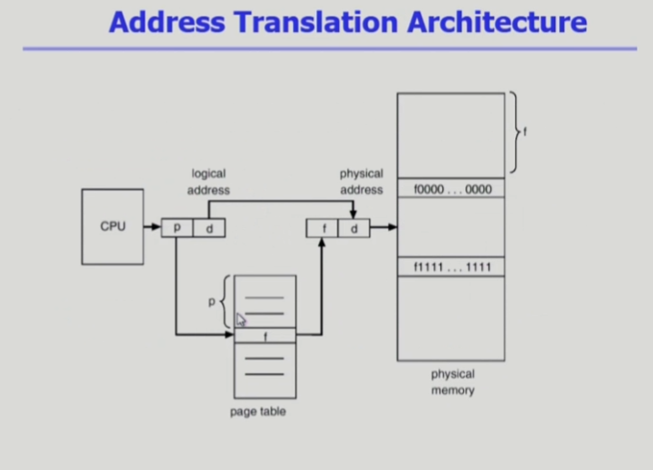
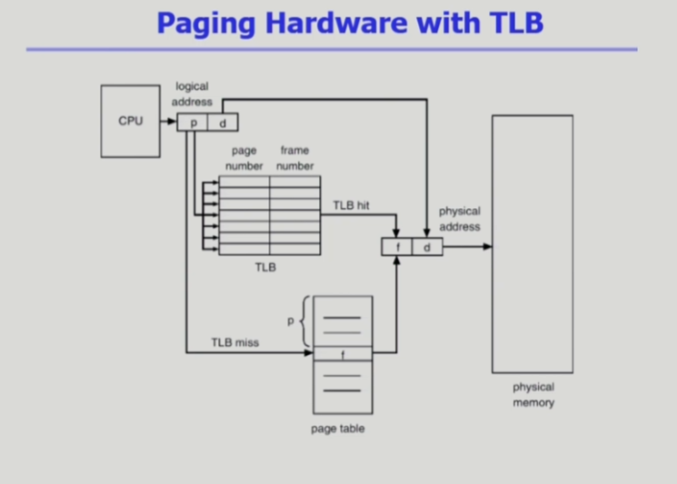
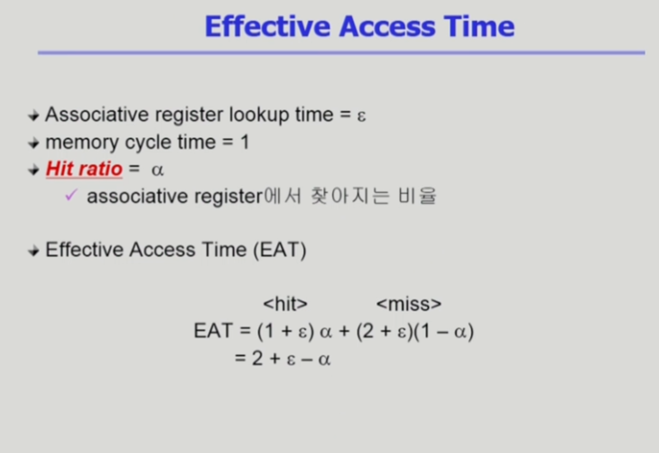
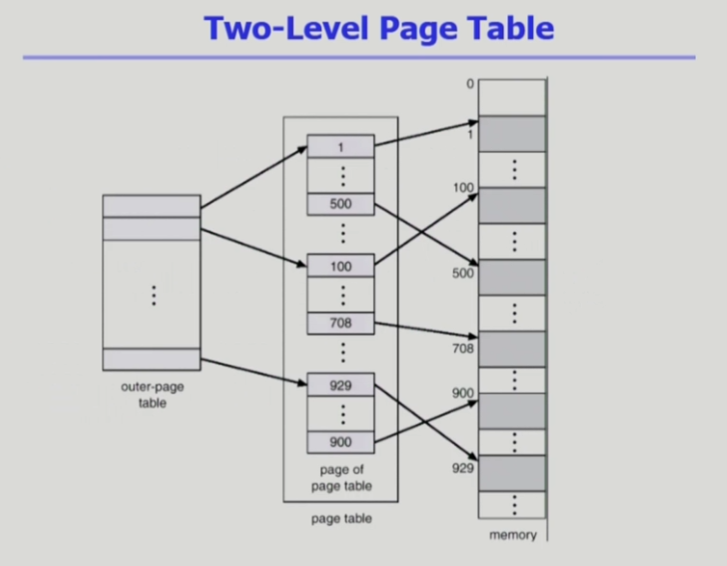
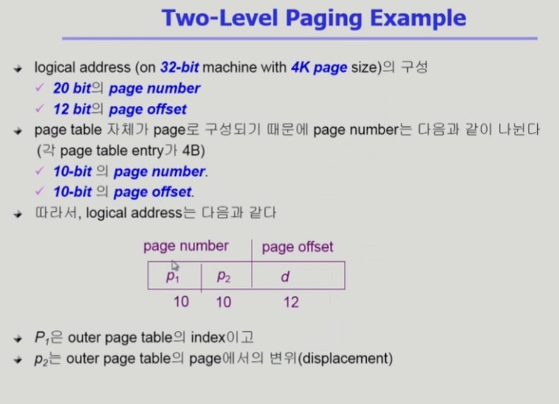
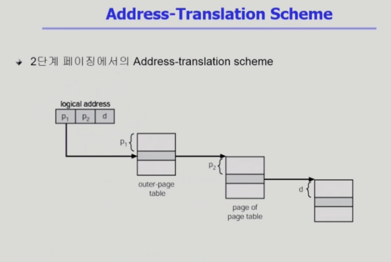

# Memory Management 02

- 지난 시간에 물리적 메모리 관리 기법 중 contiguous allocation 내용까지 배웠다. 이 경우, 논리 주소에 base register 값을 더하면 주소 변환이 되었지만, noncontiguous allocation에서는 더이상 아니다.
- 이번 시간은 noncontiguous allocation에 대해 알아보자.

## Noncontiguous allocation - Paging

- `Paging`
    - Process의 virtual memory를 `동일한 사이즈의 page` 단위로 나눔
    - Virtual memory의 내용이 page 단위로 `noncontiguous`하게 저장됨
    - 일부는 backing storage에, 일부는 physical memory에 저장

- `Basic method`
    - physical memory를 동일한 크기의 `frame`으로 나눔
    - logical memory를 동일 크기의 `page`로 나눔 (frame과 같은 크기)
    - 모든 가용 frame들을 관리
    - page table을 사용하여 logical address를 physical address로 변환
    - External fragmentation 발생 안함(같은 크기로 잘라서)
    - Internal fragmentation 발생 가능(프로그램의 크기가 반드시 page의 배수가 되지 않으면 맨 마지막에 빈 공간 가능)

- 프로그램을 동일한 페이지로 나누어 `page table`을 이용해 논리적 페이지를 물리적 page frame 내에 mapping한다.
- `page table`에는 논리적 메모리의 `페이지 수만큼 entry가 존재`한다.
    - 각 테이블의 entry에는 각 페이지가 물리적 메모리의 어느 `frame`에 올라가 있는지가 담겨 있다.
    - 주소 변환 시, index를 이용해 원하는 테이블에 탐색 없이 바로 접근 가능하다. 3번 페이지를 원하면 배열에서 특정 위치의 값을 찾듯 3번 entry로 바로 접근해 어디 올라와 있는지 알 수 있다.

 

- 위가 구체적 그림이다.
- CPU가 논리적 주소를 주면, `page number(p)와 page에서의 논리적 주소(d)`를 준다. 그러면 우선, `page number를 보고 page table에서 page frame 번호(f)를 찾아 f+d`로 실제 물리적 주소를 구한다.
- 내부에서의 상대적 위치는 같아서 내부 offset 번호(d)는 그대로다.

- 그렇다면, page table은 어디에 들어가 있어야 하나? page는 `보통 4kb단위`로 잘린다. 만약 용량이 큰 프로그램이라 페이지가 100만개면? `page table의 용량이 너무 커진다`. 또, `프로그램마다` page table이 별도로 존재해야 한다.
    - 고로, 용량이 너무 커 register, cache에 저장 불가능하고, disk에 넣으면 느리다. 그래서 `memory에 저장`한다.

## Implementation of Page Table

- Page Table은 `main memory`에 상주
- `Page-table base register(PTBR)`가 `page table`을 가리킴
- `Page-table length register(PTLR)`가 테이블 크기를 보관
- 모든 메모리 접근 연산에는 `2번의 memory access` 필요
- `page table` 접근 1번, 실제 `data/instruction` 접근 1번
- 속도 향상을 위해 `associative register` 혹은 `translation look-aside buffer(TLB)`라 불리는 고속의 lookup hardware cache 사용

- PTBR, PTLR은 앞에서 본 base reg., limit reg.의 역할을 한다.

- 위의 그림을 보자, 그림과 약간 달리 page table은 physical memory 내에 위치한다.
    - 접근 속도를 빠르게 하기 위해 TLB를 중간에 두어 주소 변환을 위해 memory에 접근하는 속도를 절약하기 위해 page table에서 빈번히 접속하는 주소를 caching하는 TLB를 둔다.
    - 정보 접근 시, 우선 TLB에서 찾아보고, 없으면 memory의 page table을 찾는다. 만약 있다면 1번으로 memory 접근이 끝나므로 시간을 많이 절약 가능하다.
    - 단, TLB는 `모든 정보를 담지 않고 일부만 담고 있다`.
    - 또, TLB는 entry로 바로 접근 불가능하고, page number를 따로 보관하고 있어야 매칭이 가능하고, 주소를 찾기 위해 `모든 TLB 내용을 훑어봐야 한다`. 그 시간이 오래 걸리므로 `parallel search가 가능한 associative register`를 이용한다.

### Associative Register
- `Associative registers(TLB)` : `parallel search`가 가능
    - `TLB에는 page table 중 일부만 존재`
- Address translation
    - page table 중 일부가 associative register에 보관되어 있음
    - 만약 해당 page number가 associative register에 있는 경우 곧바로 frame number를 얻음
    - 그렇지 않은 경우(cache miss), main memory에 있는 page table로부터 frame number를 얻음
    - TLB는 context switch 때 flush (remove old entries). Page table은 프로세스마다 다르기 때문이다.

## Effective Access Time

- TLB 접근 시간을 e라 하고(1보다 작음), 주소 변환 찾아진 적중률을 a라 하면, 2+e-a만큼 걸리는게 일반적이다. a가 엄청 커 e를 무시 가능한 수준이어야 한다.

## Two-Level Page Table
 
 

- 현대의 컴퓨터는 address space가 매우 큰 프로그램 지원
    - 32bit address 사용시: 2^32 (4GB)의 주소 공간 (즉, logical address가 32bit. 주소가 byte 단위란 점을 생각하면...서로 다른 byte 2^32가지 구분 가능. 고로, 각 메모리는 4GB까지 가능)
        - page size가 4KB시 1M개의 page table entry 필요
        - 각 page entry가 4B시 프로세스당 4MB의 page table 필요
        - 그러나, 대부분의 프로그램은 4GB의 주소 공간 중 지극히 일부분만 사용하므로 page table 공간이 심하게 낭비됨. page를 듬성듬성 쓴다고 해도 entry로 접근하니 모든 page에 대한 entry는 필요하기 때문이다.
- page table 자체를 page로 구성
- 사용되지 않는 주소 공간에 대한 outer page table의 엔트리 값은 NULL(대응하는 inner page table이 없음)
- 즉, page table을 위한 공간을 줄이기 위해 도입된 개념
    - 2단계 페이지를 쓰면 언뜻 봐서는 1단계 때보다 더 드는 것처럼 보인다. 어차피 안쪽 페이지 테이블에서 1K개의 entry가 필요하고, outer page table이 추가로 필요하니 공간도, 시간도 낭비되는 것처럼 보인다.
    - 사용되지 않는 주소공간을 NULL처리 해, `안쪽 페이지 테이블을 만들지 않고`, 바깥쪽 페이지 테이블에서 `NULL`이라는 포인터로 표기해 절약 가능하다.
    - 역으로, `실제로 사용되지 않는 공간이 정말 많다`는 것을 나타내기도 한다.
- 안쪽 페이지 테이블은 `page화 되어 들어간다`. 즉, `안쪽 페이지 각각의 크기`는 page의 크기와 동일한 `4KB`다.
    - 각 안쪽 테이블 안에는 4B짜리 entry를 1K개씩 넣을 수 있다.
- 32bit 체계에서 각각에 할당하는 bit 수를 알아보자.
    - 4KB의 각 페이지 내에서 위치 구분을 위해서는 4K=2^12니, 12bit이 필요하다. 그래서 page offset은 `12bit`이다.
    - 나머지 20bit을 어떻게 나누어야 하나? 안쪽 테이블(그림 중간 테이블)이 페이지화 되어서 들어간다고 했고, 안쪽 page table에는 1K개의 entry를 넣을 수 있다. 2^10개를 구분하기 위해 `10bit`가 필요하다.
    - 고로, 바깥쪽 페이지 테이블을 위해서는 남은 `10bit`가 할당된다.
- 64bit 체계에서는 어떨까? 한번 생각해보자.
    - 정답은 42+10+12다. 페이지가 각 4KB면, page offset에는 12bit이 필요한 것이 그대로다. 각 page별로 담을 수 있는 엔트리의 수도 1K로 그대로니 inner page table에는 10bit이 쓰인다. 나머지 바깥에서 쓰는 것은 42bit이다.
    - outer page table의 크기가 2^42개의 entry를 가지게 되며 2^44byte의 용량을 차지하니 엄청 커진다.